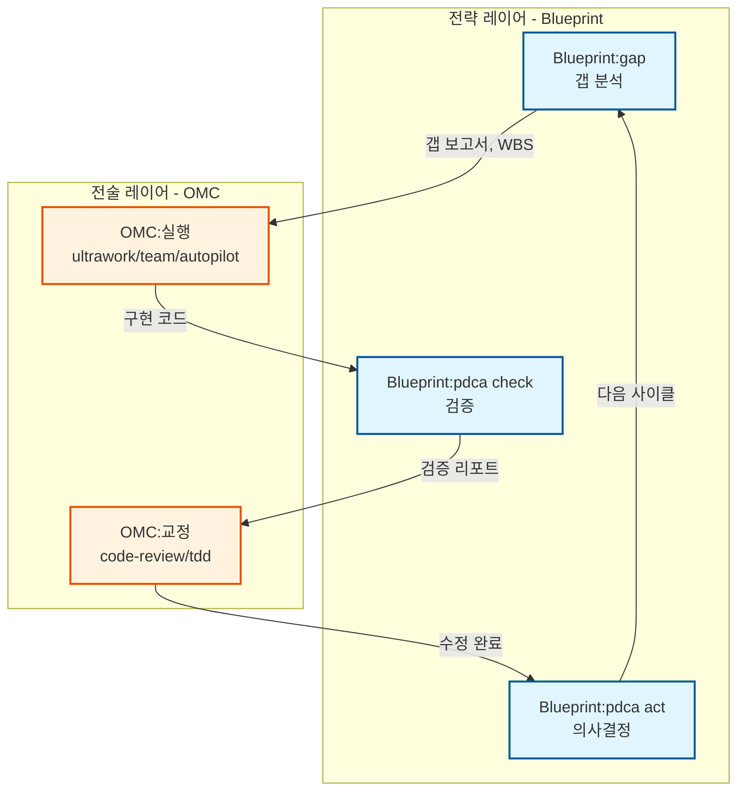
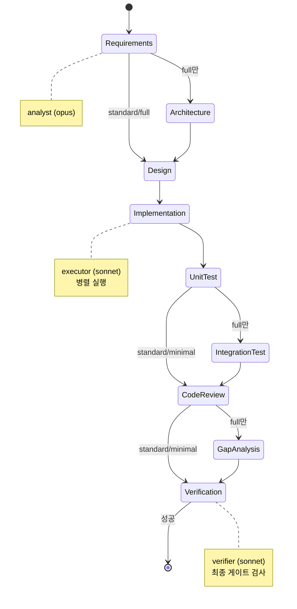
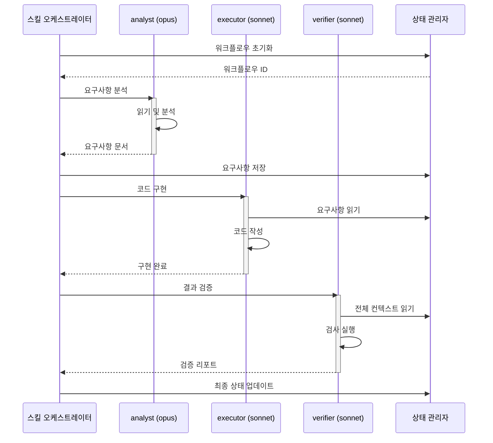
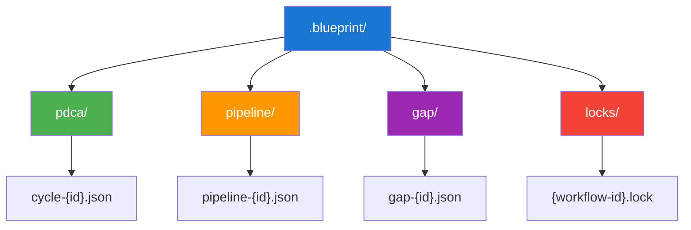

# claude-blueprint-helix

<div align="center">


**[English](README.md)** · **[한국어](README.ko.md)**

[](https://github.com/quantsquirrel/claude-blueprint-helix)
[](LICENSE)
[](https://nodejs.org)
[](https://github.com/quantsquirrel/claude-blueprint-helix)
[](https://github.com/quantsquirrel/claude-blueprint-helix/actions/workflows/ci.yml)
[](https://github.com/quantsquirrel/claude-blueprint-helix/stargazers)

</div>

> 반복적 개선을 통한 체계적 개발: Claude Code를 위한 PDCA 사이클, 갭 분석, 개발 파이프라인

<div align="center">

**🔄 계획-실행-검토-조치** → **📊 갭 분석** → **🚀 개발 파이프라인** → **✅ 더 나은 코드**

</div>

AI 지원 프로그래밍에 구조화된 개발 방법론을 도입하는 Claude Code 플러그인입니다. 지속적 개선 사이클, 체계적 갭 분석, 단계별 개발 파이프라인을 통해 더 나은 소프트웨어를 만드세요.

## 주요 기능

- **PDCA 사이클** (`/blueprint:pdca`) - 지속적 개선을 위한 반복적 Plan-Do-Check-Act 루프
- **갭 분석** (`/blueprint:gap`) - 현재 상태와 목표 상태 비교 및 심각도 기반 리포트
- **개발 파이프라인** (`/blueprint:pipeline`) - 3/6/9단계 구조화 개발 워크플로우
- **취소** (`/blueprint:cancel`) - 실행 중인 사이클 및 파이프라인의 우아한 종료

## 설치

```bash
claude plugin add quantsquirrel/claude-blueprint
```

## 빠른 시작

### PDCA 사이클

코드베이스에서 반복적 개선 사이클 실행:

```
/blueprint:pdca "인증 모듈의 에러 핸들링 개선" --iterations 3
```

각 사이클:
1. **Plan** - 현재 상태 분석 및 개선 계획 수립
2. **Do** - 변경사항 구현
3. **Check** - 목표 달성 여부 검증
4. **Act** - 결과 검토 및 다음 반복 결정

### 갭 분석

현재 상태와 목표 상태 간의 격차 식별:

```
/blueprint:gap "API가 REST 규약을 따라야 함" --severity high
```

다음을 포함한 상세 리포트 생성:
- 현재 상태 분석
- 목표 상태 명세
- 심각도별 갭 식별 (critical/high/medium/low)
- 실행 가능한 권장사항

### 개발 파이프라인

구조화된 개발 워크플로우 실행:

```
/blueprint:pipeline "사용자 인증 추가" --preset standard
```

사용 가능한 프리셋:
- **full** (9단계) - 모든 게이트를 포함한 완전한 워크플로우
- **standard** (6단계) - 균형잡힌 워크플로우 (기본값)
- **minimal** (3단계) - 작은 변경사항을 위한 빠른 반복

### 실행 중인 워크플로우 취소

실행 중인 사이클이나 파이프라인을 우아하게 중지:

```
/blueprint:cancel --all
```

## 언제 사용해야 하나요?

> **Blueprint = 설계자** (무엇을, 왜 만들 것인가) · **Claude Code = 시공자** (어떻게 만들 것인가)

**방향이 불확실할 때** Blueprint를 사용하세요. 작업이 **명확하고 구체적이면** Claude Code를 직접 사용하세요.

### 의사결정 가이드

| 현재 상황 | 스킬 | 한 줄 이유 |
|:---|:---|:---|
| 🩺 "뭔가 문제인데 정확히 뭔지 모르겠다" | `/blueprint:gap` | 현재 상태와 목표 상태 사이의 격차를 진단 |
| 📈 "측정 가능한 반복적 개선이 필요하다" | `/blueprint:pdca` | 가설 → 테스트 → 측정 루프 실행 |
| 🚀 "대규모 기능을 처음부터 구현해야 한다" | `/blueprint:pipeline` | 단계별 게이트로 빠짐없이 진행 보장 |
| ⛔ "방향이 틀렸다, 즉시 중단" | `/blueprint:cancel` | 좀비 세션으로 인한 리소스 낭비 방지 |

### 워크플로우 패턴

**단독 사용 (OMC 없이)**

```
1. /blueprint:gap "프로덕션 배포 준비 상태 점검"   → 진단
2. Claude Code: 이슈를 하나씩 수정                  → 실행
3. /blueprint:pdca "테스트 커버리지 80% 달성"       → 검증 & 반복
```

**OMC와 함께 사용 (B-O-B-O 사이클)**

```
Blueprint:gap  →  OMC:실행  →  Blueprint:검증  →  OMC:교정
  (전략)          (행동)       (측정)            (조정)
```

<details>
<summary>사용하지 말아야 할 때 (안티패턴)</summary>

- 문제 파악 없이 `/blueprint:pipeline`을 실행하지 **마세요** — 먼저 `/blueprint:gap`으로 진단하세요
- 일회성 수정에 `/blueprint:pdca`를 사용하지 **마세요** — 반복적 개선을 위해 설계되었습니다
- 워크플로우를 포기한 후 `/blueprint:cancel`을 잊지 **마세요** — 좀비 세션이 컨텍스트를 낭비합니다

</details>

## 스킬 참조

| 스킬 | 설명 | 주요 인자 |
|------|------|-----------|
| `/blueprint:pdca` | PDCA 개선 사이클 실행 | `--iterations N`, `--auto-act` |
| `/blueprint:gap` | 갭 분석 수행 | `--severity [critical\|high\|medium\|low]` |
| `/blueprint:pipeline` | 개발 파이프라인 실행 | `--preset [full\|standard\|minimal]` |
| `/blueprint:cancel` | 실행 중인 워크플로우 취소 | `--all`, `--cycle-id ID`, `--pipeline-id ID` |

## 파이프라인 프리셋

| 프리셋 | 단계 수 | 페이즈 | 적합한 용도 |
|--------|---------|--------|-------------|
| **full** | 9 | requirements → architecture → design → implementation → unit-test → integration-test → code-review → gap-analysis → verification | 중요 기능, 새로운 모듈 |
| **standard** | 6 | requirements → design → implementation → unit-test → code-review → verification | 대부분의 개발 작업 |
| **minimal** | 3 | design → implementation → verification | 빠른 수정, 작은 변경사항 |

## 아키텍처

### 구성 요소

- **6개 훅** - 라이프사이클 관리
  - `UserPromptSubmit` - 키워드 감지
  - `PostToolUse` - 진행 상황 추적
  - `SessionStart` - 상태 복원
  - `PreCompact` - 상태 보존
  - `Stop` - 우아한 종료
  - `SessionEnd` - 정리

- **9개 커스텀 에이전트** - 자체 에이전트 카탈로그
  - `analyst` (opus) - 요구사항 분석
  - `architect` (opus, 읽기 전용) - 아키텍처 설계
  - `design-writer` (sonnet) - 설계 문서 생성
  - `executor` (sonnet) - 코드 구현
  - `gap-detector` (opus, 읽기 전용) - 갭 분석
  - `pdca-iterator` (sonnet) - PDCA 사이클 오케스트레이션
  - `reviewer` (sonnet, 읽기 전용) - 코드 리뷰
  - `tester` (sonnet) - 테스트 엔지니어링
  - `verifier` (sonnet, 읽기 전용) - 검증

- **1개 MCP 서버** - 외부 도구 접근
  - `pdca_status` - PDCA 사이클 상태 조회
  - `gap_measure` - 갭 메트릭 측정
  - `pipeline_progress` - 파이프라인 진행 상황 확인

### 상태 관리

상태 파일은 `.blueprint/`에 저장됨:
- ID 기반 격리 (여러 사이클/파이프라인 동시 실행 가능)
- 락 프로토콜로 경쟁 조건 방지
- 종료 시 세션 정리
- 우아한 종료 지원

### 제로 의존성

Node.js 내장 기능만으로 구축:
- 외부 패키지 불필요
- 최소한의 설치 공간
- 빠른 시작 및 실행

## 시각적 아키텍처

### Blueprint + OMC 워크플로우 통합



**핵심 원칙**: Blueprint = 전략(무엇을/왜), OMC = 전술(어떻게)

### 파이프라인 단계 진행



### 에이전트 상호작용 패턴



### 상태 관리



상세한 아키텍처 다이어그램은 [docs/diagrams/](docs/diagrams/)를 참조하세요.

## 설정

`config/` 디렉토리의 설정 파일:

### `pdca-defaults.json`

```json
{
  "max_iterations": 4,
  "phase_timeout_ms": 300000,
  "auto_act": false,
  "default_agents": {
    "plan": ["blueprint:analyst", "blueprint:pdca-iterator"],
    "do": ["blueprint:executor"],
    "check": ["blueprint:verifier"],
    "act": ["blueprint:pdca-iterator"]
  }
}
```

### `pipeline-phases.json`

에이전트와 게이트 조건이 포함된 전체 9개 페이즈를 정의합니다. 워크플로우에 맞게 커스터마이즈 가능합니다.

## 사용 예시

### 반복적 성능 최적화

```
/blueprint:pdca "사용자 서비스의 데이터베이스 쿼리 성능 최적화" --iterations 4 --auto-act
```

각 반복마다 개선 사항을 측정하고 목표 달성 시 자동으로 진행합니다.

### 병합 전 품질 체크

```
/blueprint:gap "프로덕션 배포 준비 완료" --severity critical
```

병합 전 차단 이슈를 식별합니다.

### 전체 기능 개발

```
/blueprint:pipeline "OAuth2 인증 추가" --preset full
```

요구사항부터 검증까지 전체 9단계를 거칩니다.

## 독립 실행형 플러그인

이 플러그인은 **완전히 자체 포함**되어 있으며 oh-my-claudecode(OMC)나 다른 플러그인에 의존하지 않습니다:

- 9개 에이전트 모두 `agents/` 디렉토리에 포함
- 모든 스킬은 `blueprint:*` 에이전트만 참조
- 상태는 `.blueprint/`에 저장 (프로젝트 로컬, `~/.claude/`가 아님)
- 외부 의존성 제로 (Node.js 내장 기능만 사용)

모든 Claude Code 환경에서 바로 사용 가능합니다.

## 라이선스

MIT 라이선스 - 자세한 내용은 [LICENSE](LICENSE)를 참조하세요.

## 저장소

[https://github.com/quantsquirrel/claude-blueprint-helix](https://github.com/quantsquirrel/claude-blueprint-helix)

---

체계적 소프트웨어 개발을 위해 만들어졌습니다
