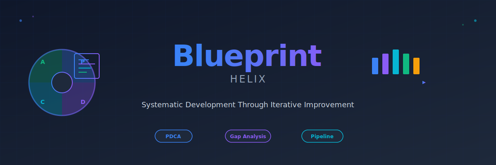
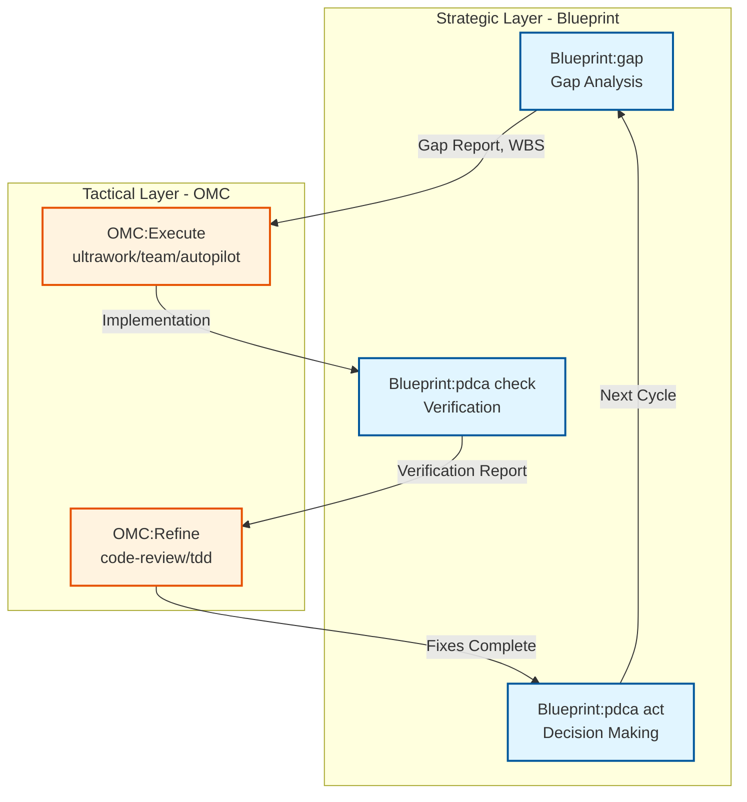
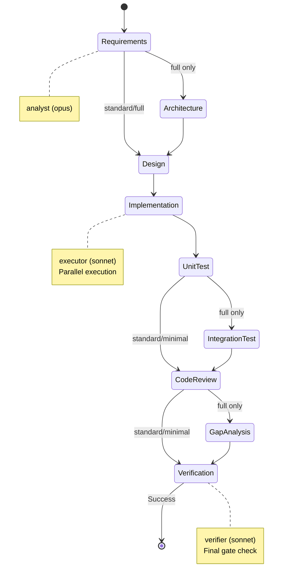
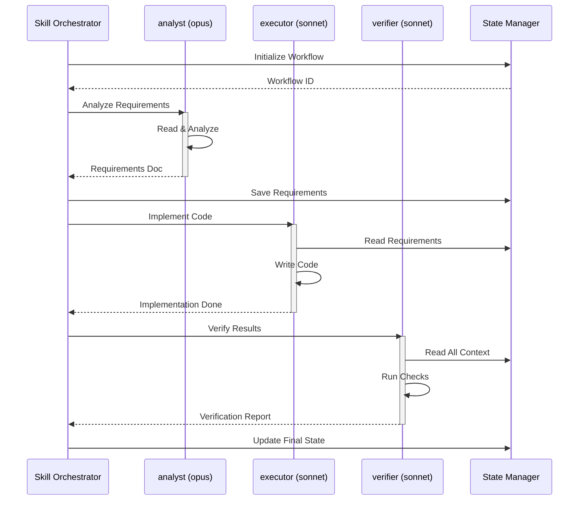
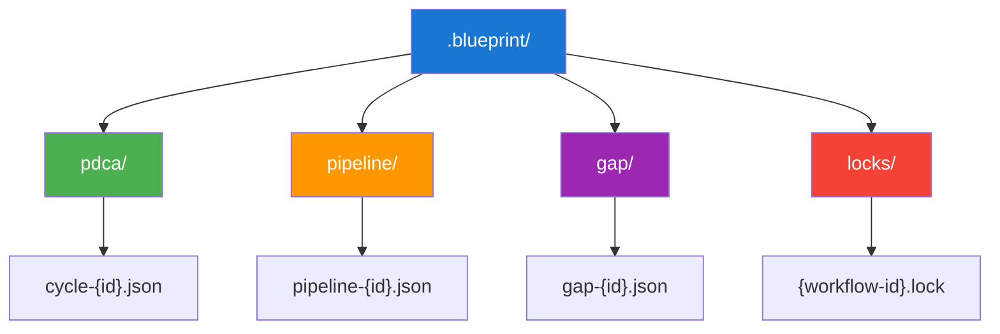

# claude-blueprint-helix

<div align="center">



**[English](README.md)** · **[한국어](README.ko.md)**

[](https://github.com/quantsquirrel/claude-blueprint-helix)
[](LICENSE)
[](https://nodejs.org)
[](https://github.com/quantsquirrel/claude-blueprint-helix)
[](https://github.com/quantsquirrel/claude-blueprint-helix/actions/workflows/ci.yml)
[](https://github.com/quantsquirrel/claude-blueprint-helix/stargazers)

</div>

> Systematic development through iterative improvement: PDCA cycles, Gap Analysis, and Dev Pipeline for Claude Code

<div align="center">

**🔄 Plan-Do-Check-Act** → **📊 Gap Analysis** → **🚀 Dev Pipeline** → **✅ Better Code**

</div>

A Claude Code plugin that brings structured development methodologies to AI-assisted programming. Build better software through continuous improvement cycles, systematic gap analysis, and phased development pipelines.

## Features

- **PDCA Cycles** (`/blueprint:pdca`) - Iterative Plan-Do-Check-Act improvement loops for continuous refinement
- **Gap Analysis** (`/blueprint:gap`) - Compare current state vs desired state with severity-based reporting
- **Dev Pipeline** (`/blueprint:pipeline`) - Structured development through 3/6/9-stage pipelines
- **Cancel** (`/blueprint:cancel`) - Graceful termination of active cycles and pipelines

## Installation

```bash
claude plugin add quantsquirrel/claude-blueprint
```

## Quick Start

### PDCA Cycle

Run iterative improvement cycles on your codebase:

```
/blueprint:pdca "Improve error handling in authentication module" --iterations 3
```

Each cycle:
1. **Plan** - Analyze current state and create improvement plan
2. **Do** - Implement changes
3. **Check** - Verify implementation meets goals
4. **Act** - Review results and decide next iteration

### Gap Analysis

Identify gaps between current and desired state:

```
/blueprint:gap "API should follow REST conventions" --severity high
```

Generates a detailed report with:
- Current state analysis
- Desired state specification
- Gap identification by severity (critical/high/medium/low)
- Actionable recommendations

### Dev Pipeline

Execute structured development workflows:

```
/blueprint:pipeline "Add user authentication" --preset standard
```

Available presets:
- **full** (9 stages) - Complete workflow with all gates
- **standard** (6 stages) - Balanced workflow (default)
- **minimal** (3 stages) - Fast iteration for small changes

### Cancel Active Workflows

Stop running cycles or pipelines gracefully:

```
/blueprint:cancel --all
```

## When to Use Each Skill

> **Blueprint = Architect** (what to build & why) · **Claude Code = Builder** (how to build it)

Use Blueprint when you're **uncertain about direction**. Use Claude Code directly when the task is **clear and specific**.

### Decision Guide

| Your Situation | Skill | One-Line Reason |
|:---|:---|:---|
| 🩺 "Something's wrong but I don't know what" | `/blueprint:gap` | Diagnoses the gap between current and desired state |
| 📈 "I need measurable, iterative improvement" | `/blueprint:pdca` | Runs hypothesis → test → measure loops |
| 🚀 "Building a large feature from scratch" | `/blueprint:pipeline` | Enforces gates so no step is skipped |
| ⛔ "Wrong direction, stop everything" | `/blueprint:cancel` | Prevents resource waste on zombie sessions |

### Workflow Patterns

**Standalone (without OMC)**

```
1. /blueprint:gap "production readiness check"     → diagnose
2. Claude Code: fix issues one by one               → execute
3. /blueprint:pdca "improve test coverage to 80%"   → verify & iterate
```

**With OMC (B-O-B-O Cycle)**

```
Blueprint:gap  →  OMC:execute  →  Blueprint:check  →  OMC:correct
  (strategy)       (action)        (measure)          (adjust)
```

<details>
<summary>When NOT to use Blueprint (anti-patterns)</summary>

- **Don't** run `/blueprint:pipeline` without first knowing the problem — use `/blueprint:gap` first
- **Don't** use `/blueprint:pdca` for one-off fixes — it's designed for iterative improvement
- **Don't** forget `/blueprint:cancel` after abandoning a workflow — zombie sessions waste context

</details>

## Skills Reference

| Skill | Description | Key Arguments |
|-------|-------------|---------------|
| `/blueprint:pdca` | Run PDCA improvement cycles | `--iterations N`, `--auto-act` |
| `/blueprint:gap` | Perform gap analysis | `--severity [critical\|high\|medium\|low]` |
| `/blueprint:pipeline` | Execute dev pipeline | `--preset [full\|standard\|minimal]` |
| `/blueprint:cancel` | Cancel active workflows | `--all`, `--cycle-id ID`, `--pipeline-id ID` |

## Pipeline Presets

| Preset | Stages | Phases | Best For |
|--------|--------|--------|----------|
| **full** | 9 | requirements → architecture → design → implementation → unit-test → integration-test → code-review → gap-analysis → verification | Critical features, new modules |
| **standard** | 6 | requirements → design → implementation → unit-test → code-review → verification | Most development tasks |
| **minimal** | 3 | design → implementation → verification | Quick fixes, small changes |

## Architecture

### Components

- **6 Hooks** - Lifecycle management
  - `UserPromptSubmit` - Keyword detection
  - `PostToolUse` - Progress tracking
  - `SessionStart` - State restoration
  - `PreCompact` - State preservation
  - `Stop` - Graceful shutdown
  - `SessionEnd` - Cleanup

- **9 Custom Agents** - Self-contained agent catalog
  - `analyst` (opus) - Requirements analysis
  - `architect` (opus, read-only) - Architecture design
  - `design-writer` (sonnet) - Design document generation
  - `executor` (sonnet) - Code implementation
  - `gap-detector` (opus, read-only) - Gap analysis
  - `pdca-iterator` (sonnet) - PDCA cycle orchestration
  - `reviewer` (sonnet, read-only) - Code review
  - `tester` (sonnet) - Test engineering
  - `verifier` (sonnet, read-only) - Verification

- **1 MCP Server** - External tool access
  - `pdca_status` - Query PDCA cycle state
  - `gap_measure` - Measure gap metrics
  - `pipeline_progress` - Check pipeline progress

### State Management

State files stored at `.blueprint/`:
- ID-based isolation (multiple cycles/pipelines can run concurrently)
- Lock protocol prevents race conditions
- Session cleanup on exit
- Graceful shutdown support

### Zero Dependencies

Built entirely with Node.js built-ins:
- No external packages required
- Minimal installation footprint
- Fast startup and execution

## Visual Architecture

### Blueprint + OMC Workflow Integration



**Key Principle**: Blueprint = Strategy (What/Why), OMC = Tactics (How)

### Pipeline Stage Progression



### Agent Interaction Pattern



### State Management



For detailed architecture diagrams, see [docs/diagrams/](docs/diagrams/).

## Configuration

Configuration files in `config/`:

### `pdca-defaults.json`

```json
{
  "max_iterations": 4,
  "phase_timeout_ms": 300000,
  "auto_act": false,
  "default_agents": {
    "plan": ["blueprint:analyst", "blueprint:pdca-iterator"],
    "do": ["blueprint:executor"],
    "check": ["blueprint:verifier"],
    "act": ["blueprint:pdca-iterator"]
  }
}
```

### `pipeline-phases.json`

Defines all 9 phases with agents and gate conditions. Customize for your workflow.

## Examples

### Iterative Performance Optimization

```
/blueprint:pdca "Optimize database query performance in user service" --iterations 4 --auto-act
```

Each iteration measures improvements and automatically proceeds if goals are met.

### Pre-Merge Quality Check

```
/blueprint:gap "Code ready for production" --severity critical
```

Identifies blocking issues before merge.

### Full Feature Development

```
/blueprint:pipeline "Add OAuth2 authentication" --preset full
```

Walks through all 9 stages from requirements to verification.

## Standalone Plugin

This plugin is **fully self-contained** and does not depend on oh-my-claudecode (OMC) or any other plugin:

- All 9 agents are bundled in the `agents/` directory
- All skills reference only `blueprint:*` agents
- State is stored in `.blueprint/` (project-local, not in `~/.claude/`)
- Zero external dependencies (Node.js built-ins only)

Works with any Claude Code installation out of the box.

## License

MIT License - see [LICENSE](LICENSE) for details.

## Repository

[https://github.com/quantsquirrel/claude-blueprint-helix](https://github.com/quantsquirrel/claude-blueprint-helix)

---

Built with ❤️ for systematic software development
