# Agent Interaction Patterns

## 1. Agent Catalog Overview

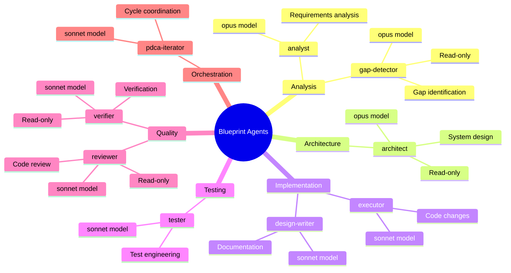

## 2. Agent Communication Pattern

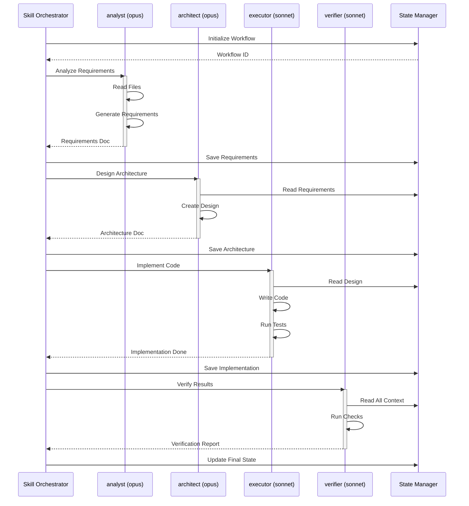

## 3. Read-Only vs Write Agents

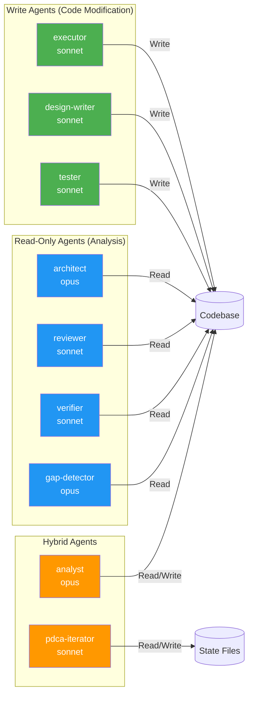

## 4. Agent Selection by Phase

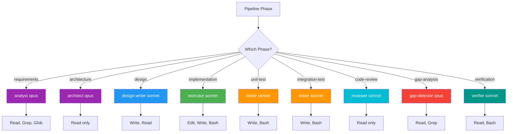

## 5. Model Cost Optimization

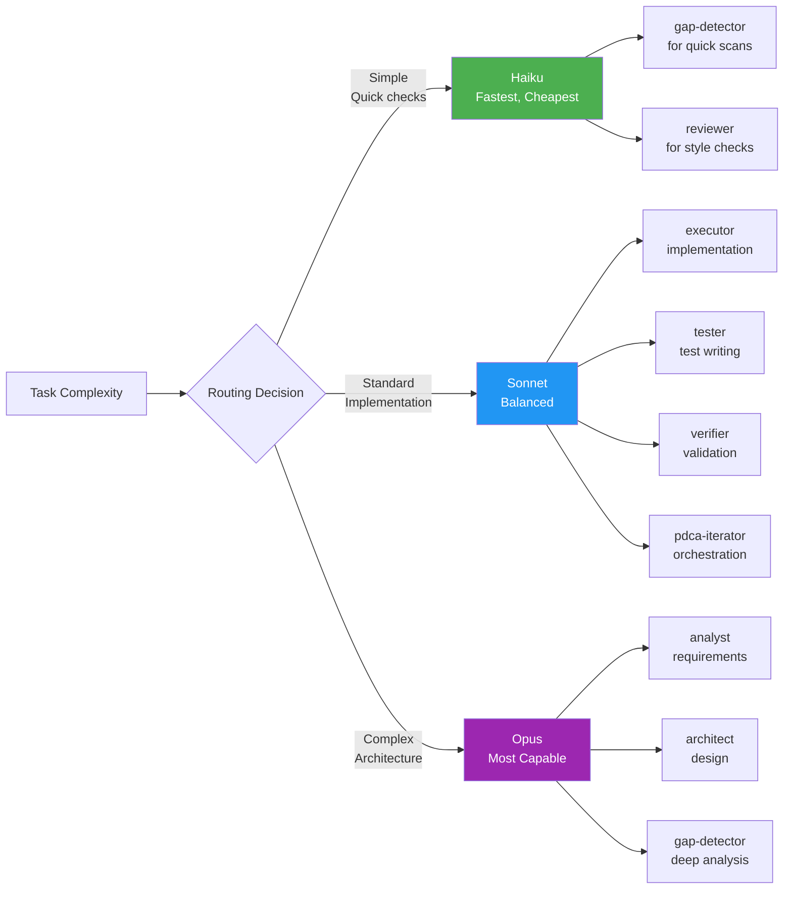

## 6. MCP Server Integration

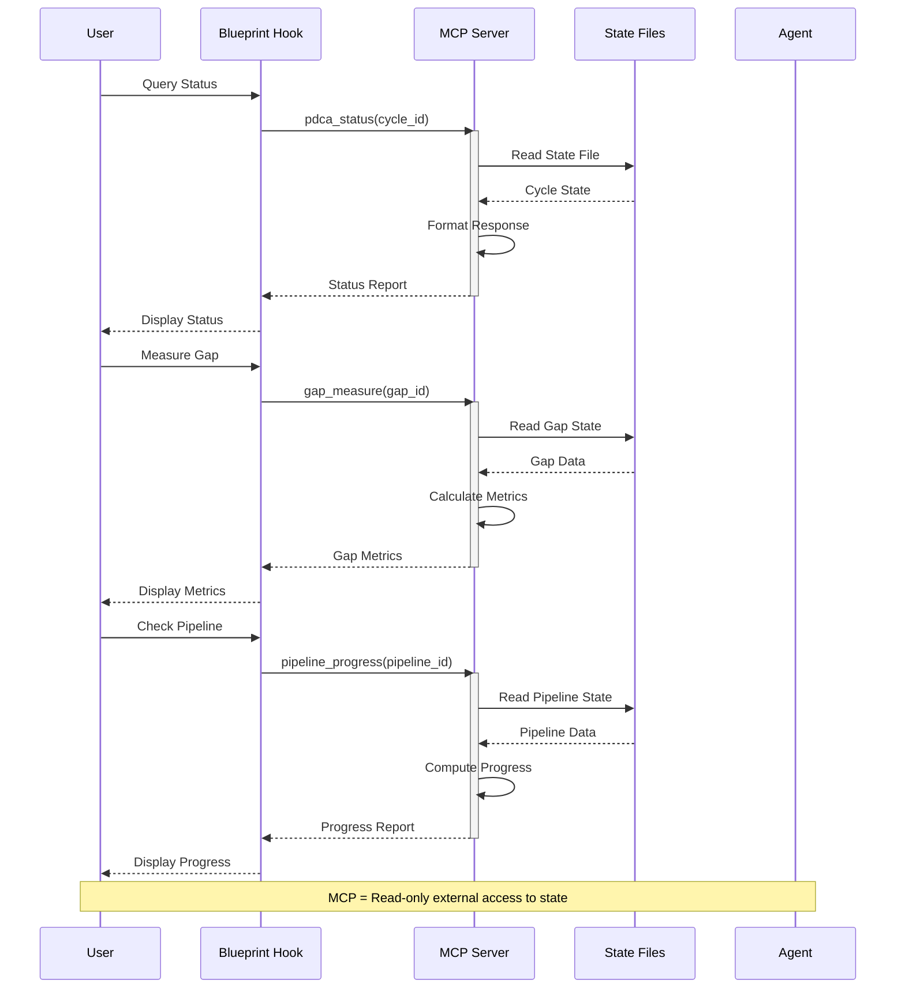

## 7. Agent Dependency Graph

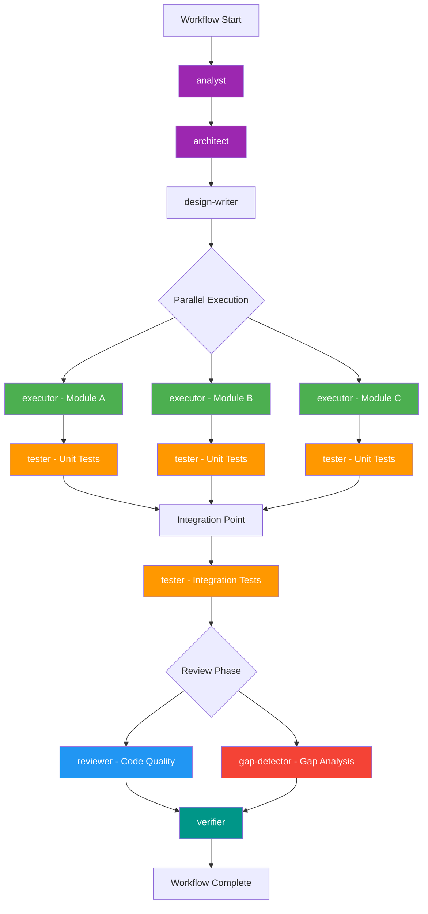

## 8. Agent Context Sharing

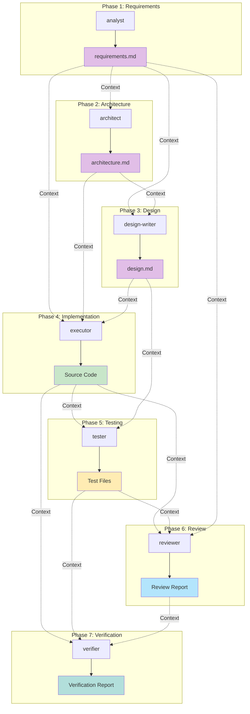

## 9. Error Handling and Retries

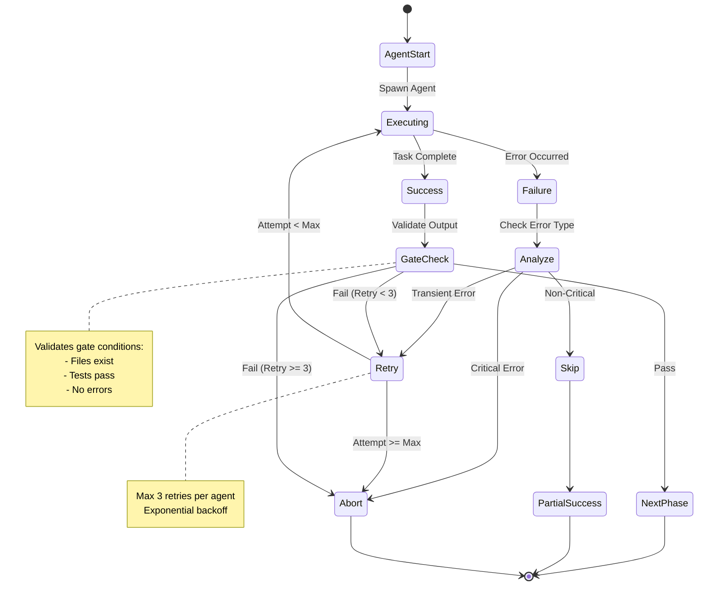

## 10. Agent Resource Usage

```mermaid
gantt
    title Agent Execution and Resource Usage
    dateFormat X
    axisFormat %M:%S

    section opus (High Cost)
    analyst           :0, 180s
    architect         :180, 270s
    gap-detector      :450, 120s

    section sonnet (Medium Cost)
    design-writer     :450, 150s
    executor Task 1   :600, 120s
    executor Task 2   :600, 120s
    executor Task 3   :600, 120s
    tester Unit       :720, 90s
    tester Integration:810, 90s
    reviewer          :900, 120s
    verifier          :1020, 60s
    pdca-iterator     :0, 1080s

    section Cost Optimization
    Parallel Execution :crit, 600, 720s

```

## 11. Orchestrator (pdca-iterator) Role

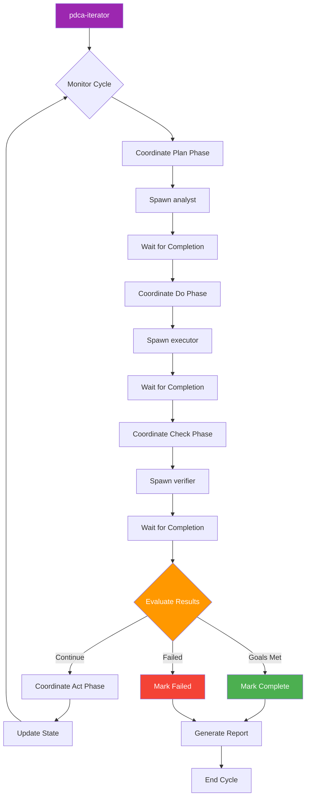
