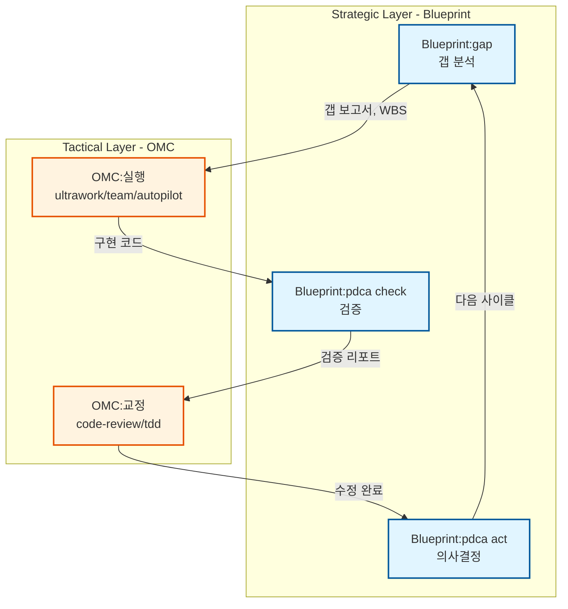
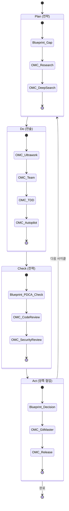
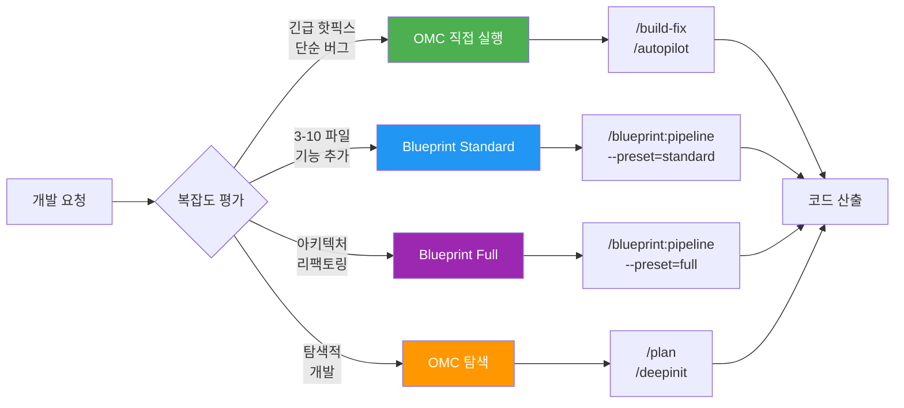
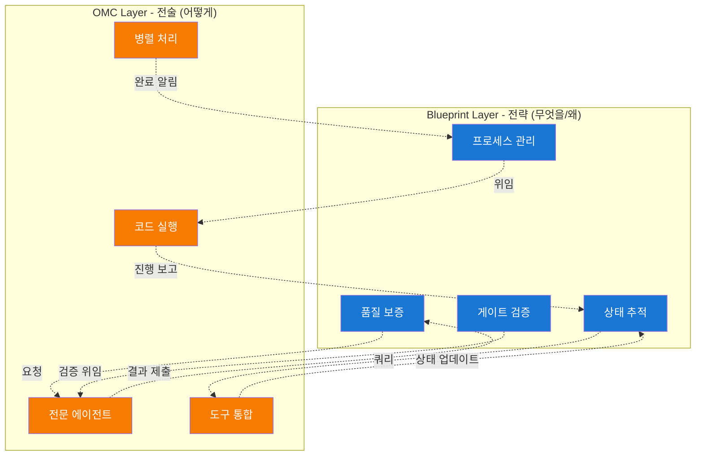
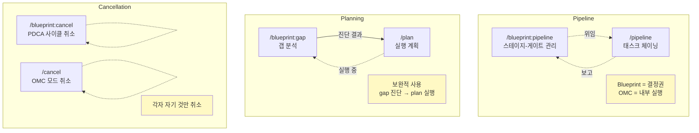
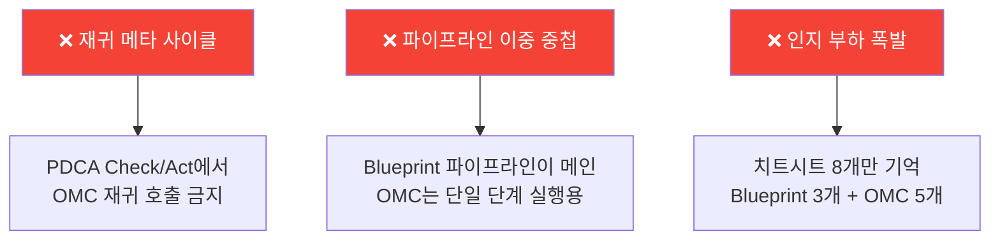
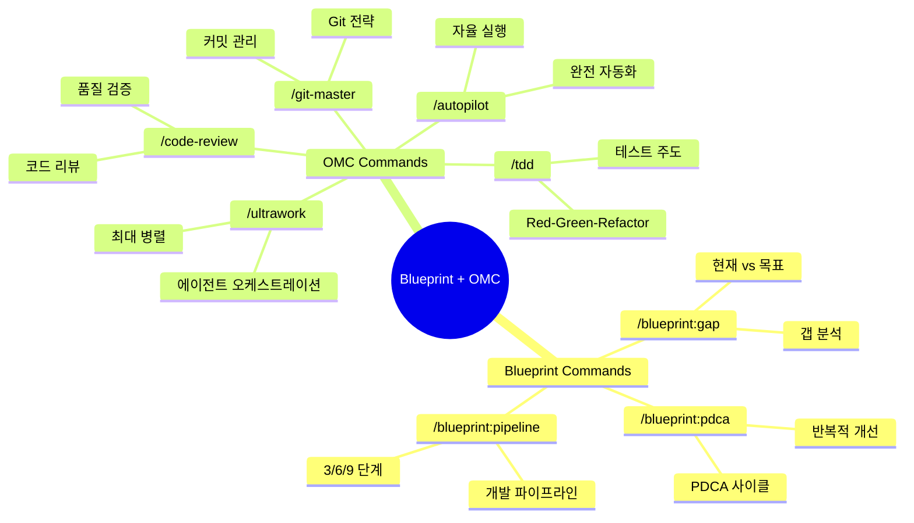

# Blueprint + OMC Workflow Architecture

## 1. B-O-B-O Cycle (Blueprint-OMC Integration)

## 2. PDCA Cycle Integration

## 3. Complexity-Based Routing

## 4. Layer Responsibility Matrix

## 5. Feature Overlap Resolution

## Anti-Patterns to Avoid

## Cheat Sheet Quick Reference

