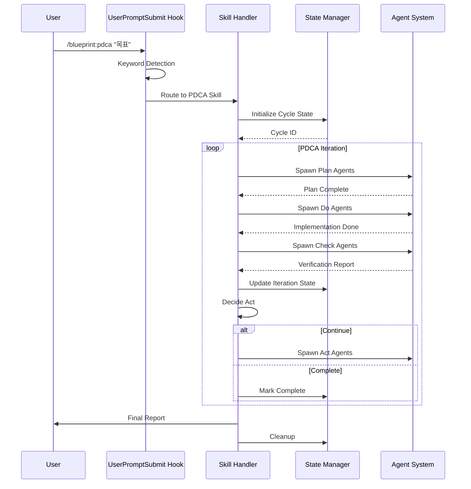
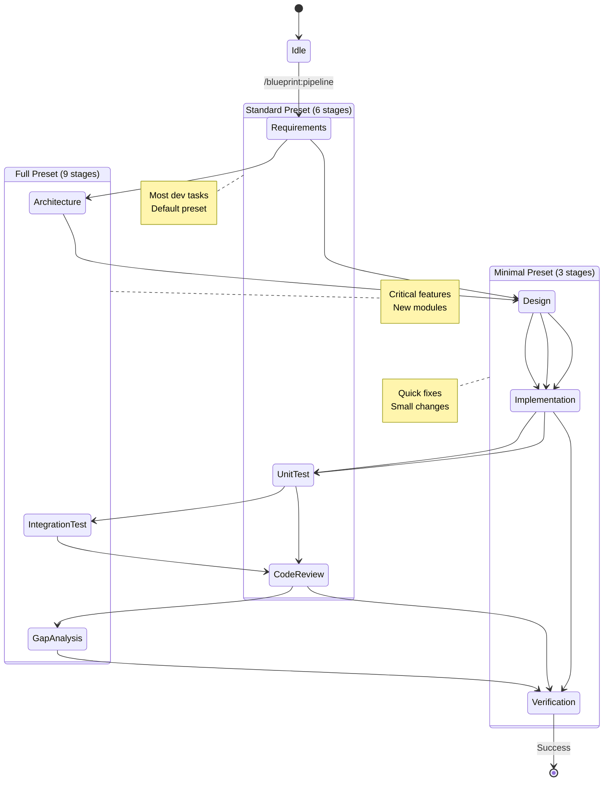
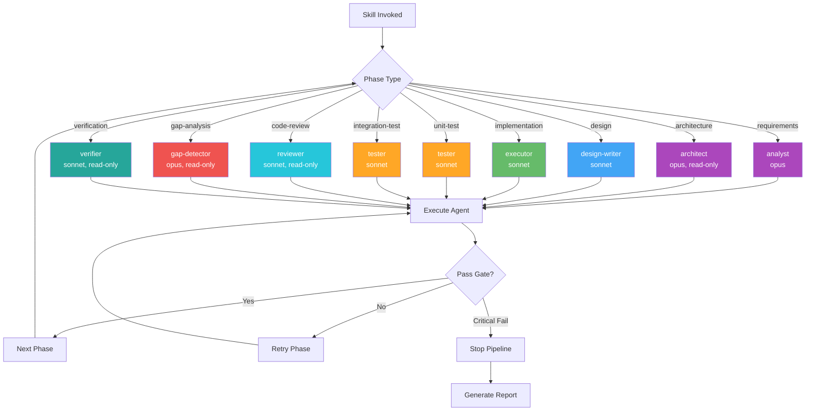
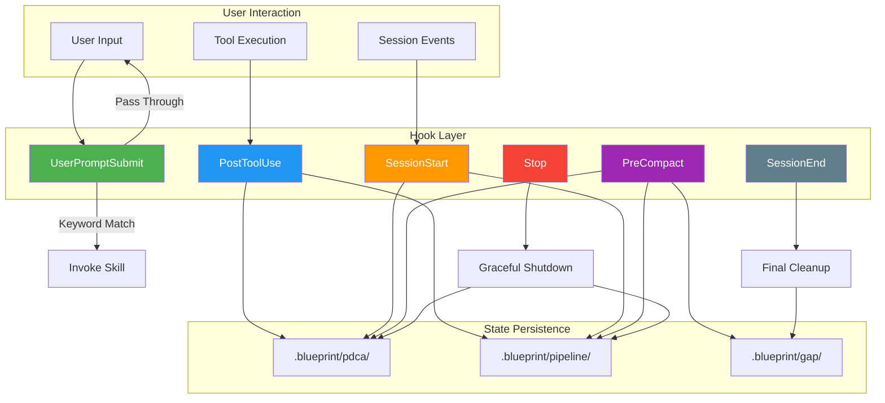
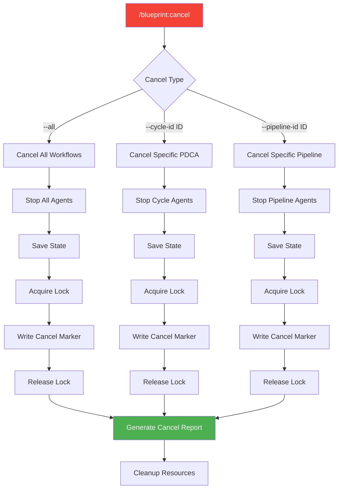
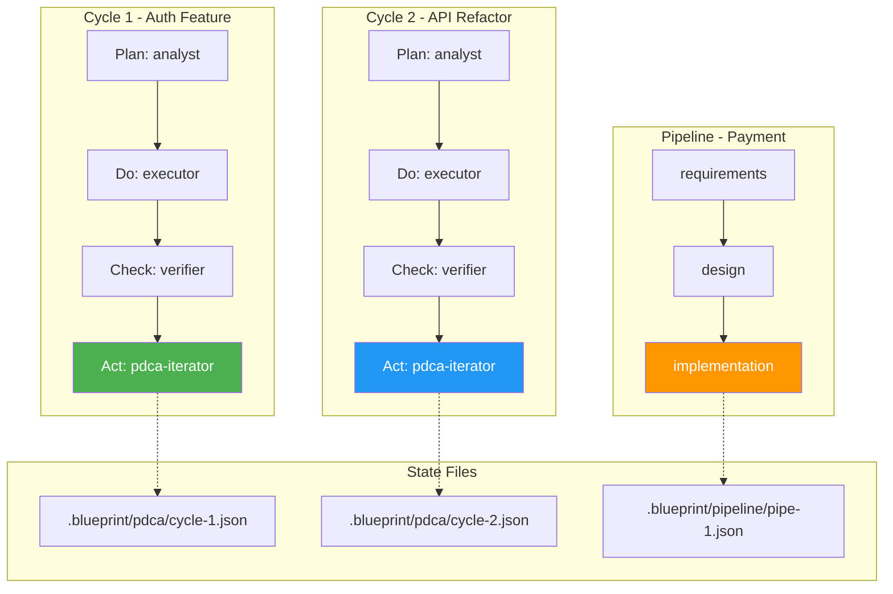

# Skill Orchestration Flow

## 1. Skill Invocation Lifecycle

## 2. Pipeline Stage Progression

## 3. Agent Selection and Execution

## 4. Hook Integration Flow

## 5. Parallel Agent Execution

```mermaid
gantt
    title Pipeline Stage Execution Timeline
    dateFormat X
    axisFormat %s

    section Requirements
    analyst (opus)           :0, 30s

    section Architecture
    architect (opus)         :30, 45s

    section Design
    design-writer (sonnet)   :75, 25s

    section Implementation
    executor (sonnet) - Task 1   :100, 20s
    executor (sonnet) - Task 2   :100, 20s
    executor (sonnet) - Task 3   :100, 20s

    section Testing
    tester (sonnet) - Unit       :120, 15s
    tester (sonnet) - Integration :135, 15s

    section Review
    reviewer (sonnet)        :150, 20s
    gap-detector (opus)      :150, 20s

    section Verification
    verifier (sonnet)        :170, 10s
```

## 6. Cancel/Cleanup Flow

## 7. Multi-Cycle Concurrency

