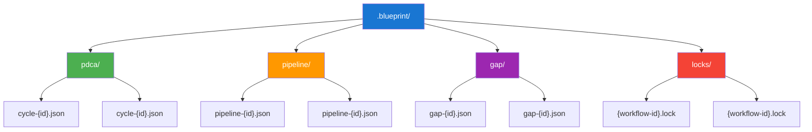
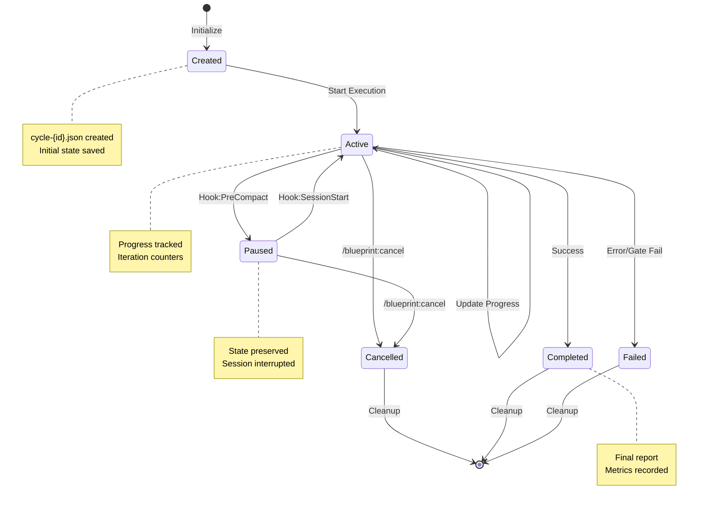
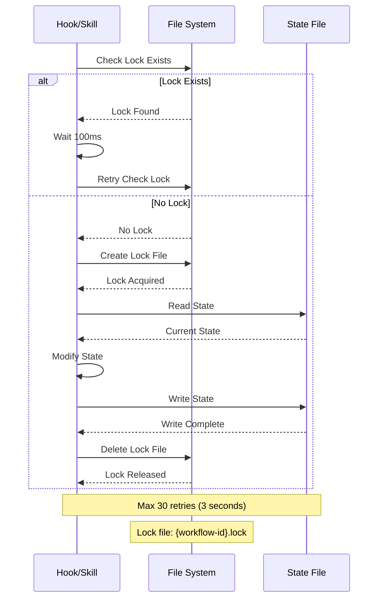
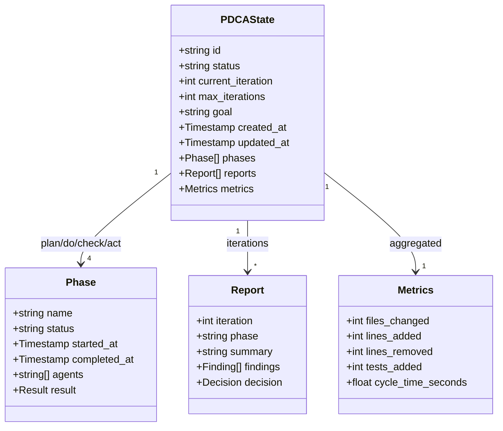
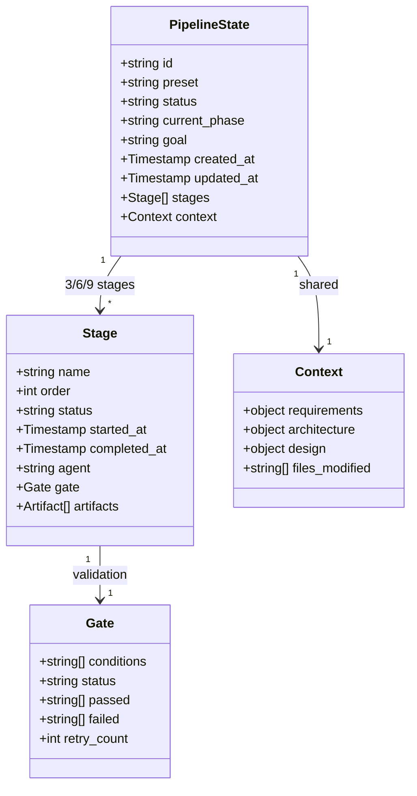
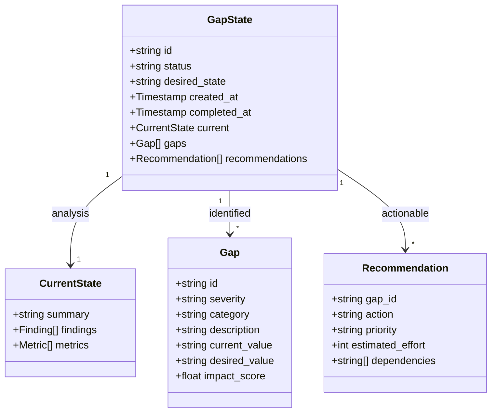
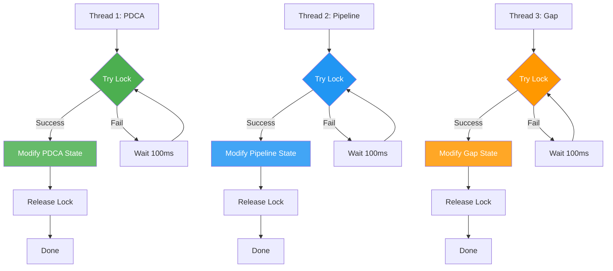
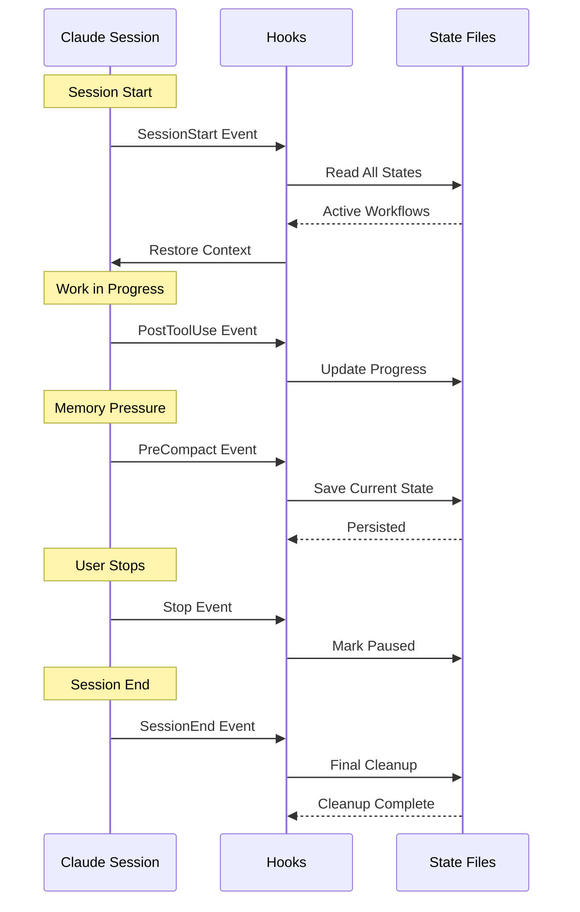
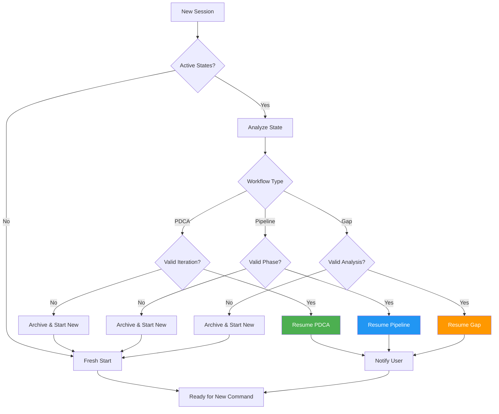
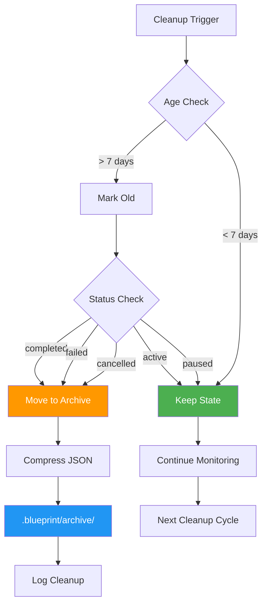

# State Management Architecture

## 1. State Directory Structure

## 2. State Lifecycle

## 3. Lock Protocol

## 4. State Schema - PDCA Cycle

## 5. State Schema - Pipeline

## 6. State Schema - Gap Analysis

## 7. Concurrent State Access

## 8. Session Persistence

## 9. State Recovery Flow

## 10. Cleanup Strategy

