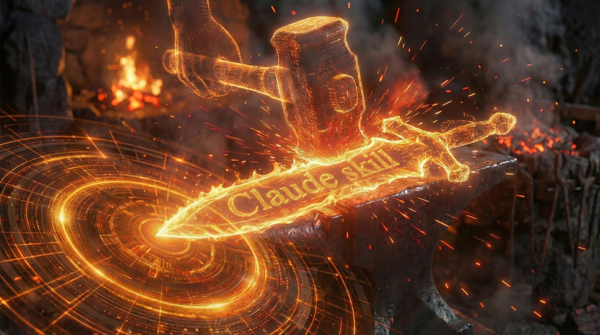
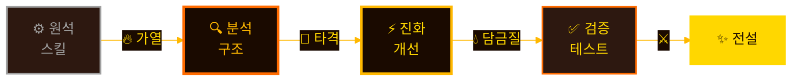
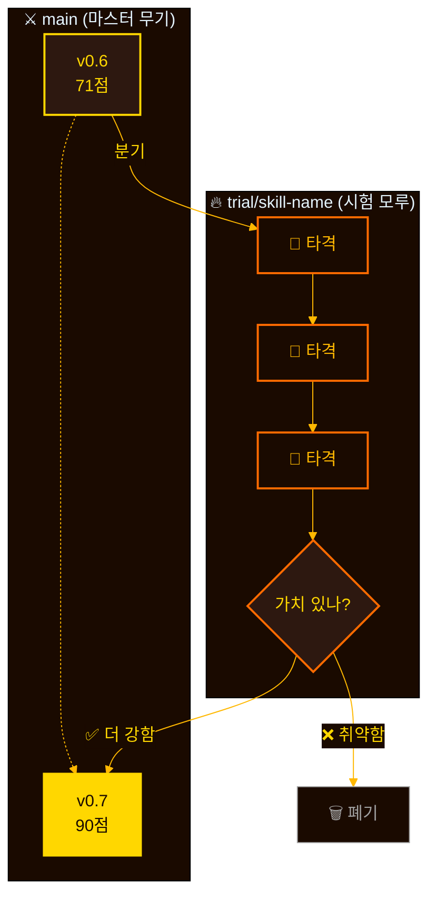
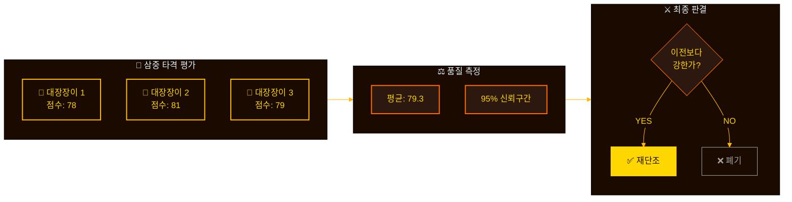

[English](README.md) | **한국어**

<div align="center">



<picture>
  <source media="(prefers-color-scheme: dark)" srcset="https://readme-typing-svg.demolab.com?font=JetBrains+Mono&weight=700&size=42&duration=3000&pause=1000&color=FFD700&center=true&vCenter=true&width=500&lines=forge">
  
</picture>

### ⚔️ 스킬을 전설의 무기로 단조하세요

[](https://github.com/quantsquirrel/claude-forge-smith)
[](https://github.com/quantsquirrel/claude-forge-smith)
[](LICENSE)
[](https://github.com/quantsquirrel/claude-forge-smith)

**TDD 기반 Claude Code 스킬 자동 진화 엔진**

</div>

━━━━━━━━━━━━━━━━━━━━━━━━━━━━━━━━━━━━━━━━━━━━━━━━

## 🔥 단조 과정

모든 전설의 무기는 원석에서 시작합니다. 가열, 타격, 담금질을 거쳐 평범한 금속이 비범한 무기로 탄생합니다.



**대장간은 멈추지 않습니다** — 각 스킬은 분석의 불로 가열되고, 개선의 망치로 두들겨지며, 테스트의 담금질을 거쳐 더 강하게 태어납니다.

━━━━━━━━━━━━━━━━━━━━━━━━━━━━━━━━━━━━━━━━━━━━━━━━

## ⚡ 빠른 시작

```bash
# 대장간 설치
git clone https://github.com/quantsquirrel/claude-forge-smith.git \
  "$CLAUDE_PLUGIN_ROOT"

# 불꽃 점화
/forge:forge --scan
```

━━━━━━━━━━━━━━━━━━━━━━━━━━━━━━━━━━━━━━━━━━━━━━━━

## 💎 기능

| 🔨 불에 단조됨 | ⚡ 자동 진화 | 🛡️ 안전한 시험 | 📊 삼중 타격 |
|:---:|:---:|:---:|:---:|
| 모든 변경 테스트됨 | 3회 평가 합의 | 원본 보존 | 95% CI 검증 |

### 🔀 이중 단조 경로 (v1.0)

재료의 품질에 따라 두 가지 방식으로 스킬을 단조할 수 있습니다:

| 경로 | 조건 | 기법 |
|------|------|------|
| **⚔️ TDD 단조** | 테스트 파일 존재 | 통계적 검증 (95% CI) |
| **🔥 패턴 단조** | 테스트 없음 | 사용 패턴 + 휴리스틱 분석 |

```bash
# 단조 방식 확인
source hooks/lib/storage-local.sh
get_upgrade_mode "my-skill"  # 반환: TDD_FIT 또는 HEURISTIC
```

### 📊 대장간 모니터 (v1.0)

무기들을 추적하고 재단조가 필요한 것을 확인하세요:

```
/monitor
```

출력 예시:
```
╔══════════════════════════════════════════════════════════════╗
║                    🔥 대장간 모니터                           ║
╠══════════════════════════════════════════════════════════════╣
║ 무기                 │ 타격수  │ 열기   │ 방식       │ 등급  ║
╠══════════════════════╪═════════╪════════╪════════════╪═══════╣
║ forge:forge    │    45   │ ▲ +20% │ TDD_FIT    │ MED   ║
╚══════════════════════════════════════════════════════════════╝
```

### 🎖️ 전설 등급 (v1.0)

뛰어난 무기는 특별한 표식을 획득합니다:

| 강화 | 보너스 | 단조 조건 |
|------|--------|----------|
| 재단조됨 | +1 | `upgraded: true` |
| 효율적 | +0.5 | 토큰/사용량 < 1500 |
| 상승세 | +0.5 | 긍정적 트렌드 |
| 검증됨 | +0.5 | 테스트 파일 존재 |

**S + 재단조됨 + 효율적 = ★★★ SSS 전설**

━━━━━━━━━━━━━━━━━━━━━━━━━━━━━━━━━━━━━━━━━━━━━━━━

## 🛡️ 시험 브랜치 — 안전한 모루

숙련된 대장장이는 결코 걸작에 직접 작업하지 않습니다. 먼저 시험 조각으로 테스트합니다.



**안전 우선** — 마스터 무기(`main`)는 시험이 가치를 증명할 때까지 절대 건드리지 않습니다. 실패한 실험은 병합되지 않고 폐기됩니다.

━━━━━━━━━━━━━━━━━━━━━━━━━━━━━━━━━━━━━━━━━━━━━━━━

## 🔨 삼중 타격 — 대장장이의 합의

한 번의 망치질은 속일 수 있습니다. 세 번의 타격이 진실을 드러냅니다.



**통계적 합의** — 세 번의 독립적인 평가. 통계적 신뢰구간. 새 버전이 명백히 우수할 때만 병합합니다.

━━━━━━━━━━━━━━━━━━━━━━━━━━━━━━━━━━━━━━━━━━━━━━━━

## 📊 단조 결과

**이전:** 71점 — 거칠고 미완성
**이후:** 90.33점 — 담금질된 전설

**+27% 향상** — Forge가 스스로를 재단조했습니다

궁극의 시험: 자신의 과정을 통해 스스로를 개선하는 도구.

━━━━━━━━━━━━━━━━━━━━━━━━━━━━━━━━━━━━━━━━━━━━━━━━

## 🔒 안전 메커니즘

숙련된 대장장이는 여러 안전장치를 갖춥니다:

| 안전장치 | 보호 |
|---------|------|
| 🔄 **롤백 준비** | 원본 항상 보존 |
| 🔒 **격리된 시험** | 별도 브랜치에서 테스트 |
| 📝 **전체 로그** | 모든 타격 기록됨 |
| ⏱️ **반복 제한** | 최대 6회 시도 |
| ✅ **테스트 검증** | 모든 테스트 통과 필수 |

대장간을 떠나는 무기는 모두 검증됩니다. 마스터 버전은 절대 손상되지 않습니다.

━━━━━━━━━━━━━━━━━━━━━━━━━━━━━━━━━━━━━━━━━━━━━━━━

## 🚀 명령어

| 명령어 | 동작 |
|--------|------|
| `/forge:forge --scan` | 🔍 재단조 가능한 스킬 탐색 |
| `/forge:forge <skill>` | ⚡ 특정 스킬 재단조 |
| `/forge:forge --history` | 📜 단조 연대기 보기 |
| `/forge:forge --watch` | 👁️ 대장간 모니터링 |

━━━━━━━━━━━━━━━━━━━━━━━━━━━━━━━━━━━━━━━━━━━━━━━━

## 📚 대장간의 이론

**괴델 머신** (Schmidhuber 2007) — 자신의 코드를 개선할 수 있는 자기 참조 시스템
**동적 적응** — 통계적 검증을 통한 점진적 진화
**TDD 안전 경계** — 테스트가 치명적 자기 수정을 방지
**다중 평가자 합의** — 여러 독립 심사자가 편향을 줄임

[전체 이론 읽기 →](docs/THEORY.md)

━━━━━━━━━━━━━━━━━━━━━━━━━━━━━━━━━━━━━━━━━━━━━━━━

<div align="center">

**영감** [skill-up](https://github.com/BumgeunSong/skill-up)

⚒️ **Claude Code로 단조됨** · 🔥 **MIT License** · ⚔️ **v1.0**

*이 프로젝트는 Anthropic과 제휴하거나 보증받지 않습니다. Claude 및 Claude Code는 Anthropic PBC의 상표입니다.*

</div>
