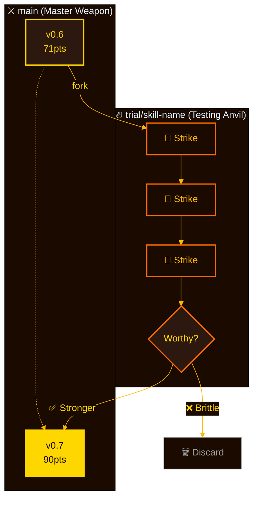
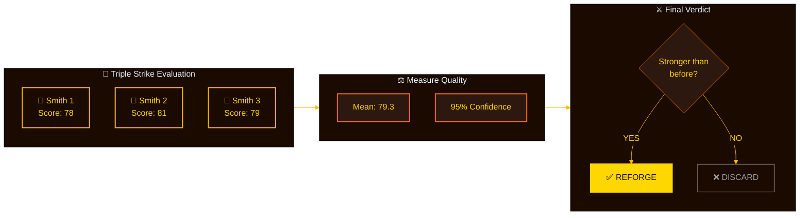

**English** | [한국어](README.ko.md)

<div align="center">


<picture>
  <source media="(prefers-color-scheme: dark)" srcset="https://readme-typing-svg.demolab.com?font=JetBrains+Mono&weight=700&size=42&duration=3000&pause=1000&color=FFD700&center=true&vCenter=true&width=500&lines=forge">
  
</picture>

### ⚔️ Forge your skills into legendary weapons

[](https://github.com/quantsquirrel/claude-forge-smith)
[](https://github.com/quantsquirrel/claude-forge-smith)
[](LICENSE)
[](https://github.com/quantsquirrel/claude-forge-smith)

**TDD-powered automatic skill evolution for Claude Code**

</div>

━━━━━━━━━━━━━━━━━━━━━━━━━━━━━━━━━━━━━━━━━━━━━━━━

## 🔥 The Forging Process

Every legendary weapon starts as raw material. Through heat, strikes, and tempering, ordinary metal becomes extraordinary.


**The Forge never rests** — Each skill is heated in analysis, struck with improvements, tempered by tests, and emerges stronger.

━━━━━━━━━━━━━━━━━━━━━━━━━━━━━━━━━━━━━━━━━━━━━━━━

## 📋 Prerequisites

Before firing up the forge, ensure you have the required tools:

| Requirement | Version | Check |
|-------------|---------|-------|
| Bash | 4.0+ | `bash --version` |
| Git | 2.0+ | `git --version` |
| Python 3 | 3.6+ | `python3 --version` |
| bc | any | `which bc` |
| jq | 1.6+ | `jq --version` |
| Claude Code CLI | latest | `claude --version` |

### Environment Variables

| Variable | Default | Description |
|----------|---------|-------------|
| `CLAUDE_PLUGIN_ROOT` | *(your plugin install directory)* | Plugin installation path |
| `FORGE_EVALUATOR_CMD` | (built-in) | Custom evaluator script path |

━━━━━━━━━━━━━━━━━━━━━━━━━━━━━━━━━━━━━━━━━━━━━━━━

## ⚡ Quick Start

```bash
# Install the forge
git clone https://github.com/quantsquirrel/claude-forge-smith.git \
  "$CLAUDE_PLUGIN_ROOT"

# Ignite the flames
/forge:forge --scan
```

━━━━━━━━━━━━━━━━━━━━━━━━━━━━━━━━━━━━━━━━━━━━━━━━

## 💎 Features

| 🔨 Forged in Fire | ⚡ Auto Evolution | 🛡️ Safe Trials | 📊 Triple Strike |
|:---:|:---:|:---:|:---:|
| Every change tested | 3× evaluation consensus | Original preserved | 95% CI validation |

### 🔀 Dual Forging Paths (v1.0)

Skills can be forged through two methods depending on material quality:

| Path | Condition | Technique |
|------|-----------|-----------|
| **⚔️ TDD Forge** | Test files exist | Statistical validation (95% CI) |
| **🔥 Pattern Forge** | No tests | Usage patterns + heuristic analysis |

```bash
# Check forging method
source hooks/lib/storage-local.sh
get_upgrade_mode "my-skill"  # Returns: TDD_FIT or HEURISTIC
```

### 📊 Forge Monitor (v1.0)

Track your weapons and see which need reforging:

```
/monitor [--priority=HIGH|MED|LOW] [--type=explicit|silent|all]
```

Output:
```
╔══════════════════════════════════════════════════════════════════════╗
║                      🔥 Forge Monitor                                  ║
╠══════════════════════════════════════════════════════════════════════╣
║ Quality Analysis (품질 기반 - 사용량과 무관)                          ║
╠════════════════════════╤══════════╤═══════╤══════════╤═══════════════╣
║ Skill                  │ Type     │ Score │ Grade    │ Priority      ║
╠════════════════════════╪══════════╪═══════╪══════════╪═══════════════╣
║ omc:git-master         │ silent   │   45  │ C        │ [HIGH] ⚡     ║
║ forge:forge      │ explicit │   90  │ A        │ [READY] ✓     ║
╚════════════════════════╧══════════╧═══════╧══════════╧═══════════════╝
```

### ⚔️ Skill Type Detection (v1.0)

Skills are classified by how they're invoked:

| Type | Description | Quality Criteria |
|------|-------------|------------------|
| **explicit** | User invokes with `/command` | argument-hint, mode docs, examples |
| **silent** | Auto-triggered by context | trigger keywords, when-to-use, red-flags |

```bash
# Check skill type
source hooks/lib/storage-local.sh
get_skill_type "my-skill"  # Returns: explicit | silent
```

### 📈 Quality-Based Recommendations (v1.0)

**Core Principle: Usage ≠ Quality**

The forge evaluates skills by structure, not popularity:

| Priority | Score | Action |
|----------|-------|--------|
| **HIGH** | < 40 | Immediate reforging needed |
| **MED** | 40-59 | Improvement recommended |
| **LOW** | 60-79 | Optional enhancement |
| **READY** | ≥ 80 | Quality assured |

```bash
# Get quality score
get_skill_quality_score "my-skill"
# Returns: JSON with score, breakdown, grade (A/B/C/D)
```

### 🎖️ Legendary Grades (v1.0)

Exceptional weapons earn special marks:

| Enhancement | Bonus | Forged When |
|-------------|-------|-------------|
| Reforged | +1 | `upgraded: true` |
| Efficient | +0.5 | tokens/usage < 1500 |
| Hot Streak | +0.5 | positive trend |
| Tested | +0.5 | has test files |

**S + Reforged + Efficient = ★★★ SSS LEGENDARY**

━━━━━━━━━━━━━━━━━━━━━━━━━━━━━━━━━━━━━━━━━━━━━━━━

## 🛡️ Trial Branch — The Safe Anvil

Master smiths never work directly on the masterpiece. They test on trial pieces first.



**Safety First** — The master weapon (`main`) is never touched until the trial proves worthy. Failed experiments are discarded, not merged.

━━━━━━━━━━━━━━━━━━━━━━━━━━━━━━━━━━━━━━━━━━━━━━━━

## 🔨 Triple Strike — The Smith's Consensus

A single hammer blow can deceive. Three strikes reveal the truth.



**Statistical Consensus** — Three independent evaluations. Statistical confidence intervals. Only merge if the new version is provably superior.

━━━━━━━━━━━━━━━━━━━━━━━━━━━━━━━━━━━━━━━━━━━━━━━━

## 📊 Forging Results

**Before:** 71 points — Raw, unrefined
**After:** 90.33 points — Tempered, legendary

**+27% improvement** — Forge reforged itself

The ultimate test: A tool that improves itself through its own process.

━━━━━━━━━━━━━━━━━━━━━━━━━━━━━━━━━━━━━━━━━━━━━━━━

## 🔒 Safety Mechanisms

Master smiths build in multiple safeguards:

| Safeguard | Protection |
|-----------|------------|
| 🔄 **Rollback Ready** | Original always preserved |
| 🔒 **Isolated Trials** | Test in separate branch |
| 📝 **Full Logs** | Every strike recorded |
| ⏱️ **Iteration Limit** | Maximum 6 attempts |
| ✅ **Test Verification** | All tests must pass |

No weapon leaves the forge untested. No master version is ever corrupted.

━━━━━━━━━━━━━━━━━━━━━━━━━━━━━━━━━━━━━━━━━━━━━━━━

## 🚀 Commands

| Command | Action |
|---------|--------|
| `/forge:forge --scan` | 🔍 Scout for skills ready to reforge |
| `/forge:forge <skill>` | ⚡ Reforge a specific skill |
| `/forge:forge --history` | 📜 View forging chronicles |
| `/forge:forge --watch` | 👁️ Monitor the forge |
| `/forge:monitor` | 📊 Quality dashboard |
| `/forge:smelt` | 🔥 Skill creation with TDD methodology |

### 💡 Argument Hints (v1.0)

When typing a slash command, you'll see available modes:

```
/forge <skill-name> [--precision=high|-n5] - modes: TDD_FIT|HEURISTIC
/monitor [--priority=HIGH|MED|LOW] [--type=explicit|silent|all]
```

Add `argument-hint` to your skill's frontmatter to enable this feature.

━━━━━━━━━━━━━━━━━━━━━━━━━━━━━━━━━━━━━━━━━━━━━━━━

## ⚙️ Configuration

Forge behavior can be customized via `config/settings.env`:

| Setting | Default | Description |
|---------|---------|-------------|
| `STORAGE_MODE` | `local` | Storage backend (currently only local supported) |
| `LOCAL_STORAGE_DIR` | `~/.claude/.skill-evaluator` | Local storage directory for skill data |
| `SKILL_EVAL_DEBUG` | `false` | Enable debug logging to stderr |

**Example:**
```bash
# Enable debug mode
export SKILL_EVAL_DEBUG=true

# Use custom storage location
export LOCAL_STORAGE_DIR="$HOME/.my-forge-data"
```

━━━━━━━━━━━━━━━━━━━━━━━━━━━━━━━━━━━━━━━━━━━━━━━━

## 🔧 Troubleshooting

### Common Issues

#### `bc: command not found`
```bash
# macOS
brew install bc

# Ubuntu/Debian
sudo apt-get install bc

# Fedora/RHEL
sudo dnf install bc
```

#### `jq: command not found`
```bash
# macOS
brew install jq

# Ubuntu/Debian
sudo apt-get install jq

# Fedora/RHEL
sudo dnf install jq
```

#### `Permission denied` when running commands
```bash
# Make scripts executable
cd "$CLAUDE_PLUGIN_ROOT"
chmod +x hooks/*.sh
chmod +x bin/*
```

#### Plugin not detected by Claude Code
1. Check installation path matches `CLAUDE_PLUGIN_ROOT`
2. Verify `plugin.json` exists in the plugin root
3. Restart Claude Code CLI
4. Run `/help` to see if Forge commands appear

#### Forge evaluations fail silently
```bash
# Enable debug logging
export SKILL_EVAL_DEBUG=true

# Check storage directory exists
ls -la ~/.claude/.skill-evaluator

# Verify evaluator script is executable
ls -la "$CLAUDE_PLUGIN_ROOT/bin/skill-evaluator.py"
```

━━━━━━━━━━━━━━━━━━━━━━━━━━━━━━━━━━━━━━━━━━━━━━━━

## 📚 The Theory Behind the Forge

**Gödel Machines** (Schmidhuber 2007) — Self-referential systems that can improve their own code
**Dynamic Adaptation** — Incremental evolution with statistical validation
**TDD Safety Boundaries** — Tests prevent catastrophic self-modification
**Multi-Evaluator Consensus** — Multiple independent judges reduce bias

[Read the full theory →](docs/THEORY.md)

━━━━━━━━━━━━━━━━━━━━━━━━━━━━━━━━━━━━━━━━━━━━━━━━

<div align="center">

**Inspired by** [skill-up](https://github.com/BumgeunSong/skill-up)

⚒️ **Forged with Claude Code** · 🔥 **MIT License** · ⚔️ **v1.0**

*This project is not affiliated with or endorsed by Anthropic. Claude and Claude Code are trademarks of Anthropic PBC.*

</div>
