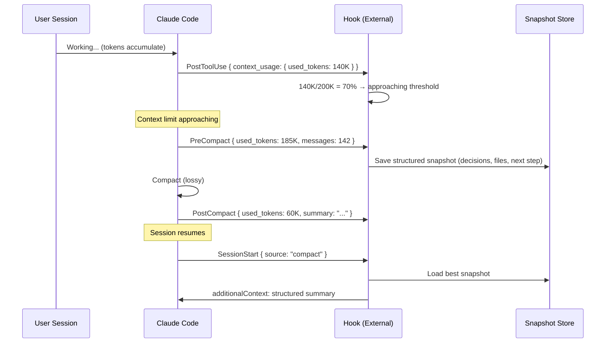

# Hook payload enrichment: expose token counts for context-aware tooling

## Abstract

Long sessions lose context silently. The hooks API provides the right extension points, but hook payloads lack the data needed to build reliable context management — most critically, **accurate token counts**. This proposal adds three small, backward-compatible fields that unlock an entire class of context-aware tooling the community is already building with workarounds.

## Problem

Context compaction and session boundaries cause unrecoverable information loss. This is the single most-reported friction point for long autonomous sessions:

| Evidence | Detail |
|----------|--------|
| Related issues | #11455, #21128, #24320, #33088 — all OPEN |
| Community workarounds | 8+ independent GitHub repos building handoff/context tools |
| Academic basis | "Lost in the Middle" (Stanford) — 15–47% accuracy drop as context grows beyond 10K tokens |
| Cost impact | 1M-token session ≈ $10/call; a 500-token handoff ≈ $0.01 (1,000x reduction) |

The community has converged on a common architecture: **monitor context pressure → snapshot before compaction → restore on resume**. Every implementation hits the same three walls.

## Current Workarounds & Their Walls

| What the community builds | Where it breaks |
|--------------------------|-----------------|
| Token tracking via `PostToolUse` output size | `chars/4` estimate diverges 40–60% from actual BPE count. Handoff triggers too early or too late. |
| `PreCompact` hook to snapshot state | Payload contains only `trigger` and `custom_instructions` — no token count, no message count, no way to gauge severity. |
| `SessionStart` hook to restore context | `additionalContext` is injected as plain text, not structured session state. 8,000-char truncation loses information silently. |

These aren't edge cases — they're the **default experience** for anyone building on the hooks API for context management. See #33088 for a detailed account from another production user hitting identical walls.

## Proposed Changes

**Scope: Three additive payload fields. No behavioral changes. No breaking changes.**

### 1. `context_usage` in all hook event payloads

Add a `context_usage` object to the common input fields that all hooks already receive:

```json
{
  "session_id": "abc123",
  "hook_event_name": "PostToolUse",
  "context_usage": {
    "used_tokens": 142857,
    "max_tokens": 200000,
    "usage_ratio": 0.714
  }
}
```

`used_tokens` should reflect the **actual tokenizer count**, not an estimate. This single field eliminates the most severe limitation (chars/4 divergence) and enables accurate context pressure monitoring without heuristics.

### 2. Enriched `PreCompact` payload

```json
{
  "hook_event_name": "PreCompact",
  "trigger": "auto",
  "context_usage": { "used_tokens": 180000, "max_tokens": 200000, "usage_ratio": 0.9 },
  "messages_count": 142,
  "tool_calls_count": 87
}
```

This lets hooks make informed decisions about *what* to preserve before the lossy compression occurs. Currently, `PreCompact` fires but provides no way to gauge the magnitude of what's about to be lost.

### 3. `PostCompact` summary access

```json
{
  "hook_event_name": "PostCompact",
  "trigger": "auto",
  "context_usage": { "used_tokens": 60000, "max_tokens": 200000, "usage_ratio": 0.3 },
  "compact_summary": "Generated conversation summary..."
}
```

The `compact_summary` field already exists per the docs. Adding `context_usage` here lets tools track the before/after delta and validate that their snapshots captured the right information.

## Data Flow



## Proof of Concept

[claude-handoff-baton](https://github.com/quantsquirrel/claude-handoff-baton) implements this full lifecycle using the current hooks API:

- **4 hooks**: PrePromptSubmit (task sizing), PostToolUse (token monitoring), PreCompact (snapshot), SessionStart (restore)
- **72 regression tests**, 0 failures
- **Auto-scaling output**: L1 (~150 tokens) / L2 (~400) / L3 (~700) based on session complexity
- **Security**: Auto-redaction of JWT tokens, API keys, Bearer tokens
- **Dynamic thresholds**: Small tasks trigger at 85%, large refactors at 30%

The tool works but is fundamentally limited by the three walls described above. The `chars/4` token estimate is the most impactful — it causes handoff suggestions to fire at the wrong time in ~40% of sessions.

## Security & Privacy Considerations

- **Token counts are metadata, not content.** Exposing `used_tokens` reveals session length but not session content. This is comparable to `Content-Length` in HTTP — standard practice.
- **No new content exposure.** All proposed fields are counts or ratios. The `compact_summary` in `PostCompact` already exists per current docs.
- **Quota inference risk is minimal.** Token counts are already inferrable from `tool_response` sizes in `PostToolUse`. Making them accurate doesn't create new attack surface.
- **Opt-out path.** If privacy is a concern, these fields could be gated behind a setting (e.g., `hooks.expose_token_counts: true`), though we'd argue they should be on by default since hooks are already a trust boundary.

## Alternatives Considered

| Alternative | Why it falls short |
|-------------|-------------------|
| **Keep using `chars/4` estimation** | 40–60% divergence from actual BPE count. Unreliable for threshold-based decisions. |
| **Parse `.jsonl` transcript directly** | Undocumented format. Breaks across versions. File may be locked during writes. |
| **Use `--continue` instead of handoff** | Restores *everything* (100K+ tokens). No knowledge extraction. Single-machine only. |
| **Write everything to CLAUDE.md** | 3,000-token recommended limit. Manual. Lost on compaction if not in project root. |
| **Wait for native handoff support** | 6 related issues open, 0% resolution rate. Community needs a solution now. |

## Success Metrics

If adopted, we'd expect to measure:

- **Token estimate accuracy**: chars/4 error rate drops from ~40–60% to 0% (actual count)
- **Handoff timing**: False-positive handoff suggestions decrease proportionally
- **Community adoption**: Hook-based context tools can remove estimation workarounds (~50 LOC per tool)
- **Issue closure**: Partially addresses #11455, #24320, #33088

## Open Questions

1. **Should `used_tokens` count system prompt tokens?** (We'd suggest yes, for total context pressure accuracy.)
2. **What's the performance cost of exposing token counts per hook event?** (Likely negligible — the tokenizer already ran.)
3. **Should `context_usage` include a breakdown** (system / user / assistant / tool_output)? (Nice-to-have, not required for v1.)
4. **Does the 1M-context tier change the calculus?** (No — cost, latency, and "Lost in the Middle" effects still apply.)

## Backward Compatibility

All proposed changes are **pure additions** to existing JSON payloads:

- No existing fields are modified or removed
- Hooks that don't read `context_usage` are unaffected
- No changes to hook execution semantics, exit codes, or decision control

## Gradual Rollout Suggestion

| Phase | Change | Risk |
|-------|--------|------|
| 1 | Add `context_usage` to `PostToolUse` and `PreCompact` | Minimal — additive JSON field |
| 2 | Add `context_usage` to all remaining hook events | Low — same mechanism, wider scope |
| 3 | Evaluate need for `HandoffCreated` event based on Phase 1–2 adoption | Deferred — community feedback first |

---

*Built from daily production usage of Claude Code hooks. Happy to contribute implementation if helpful.*
