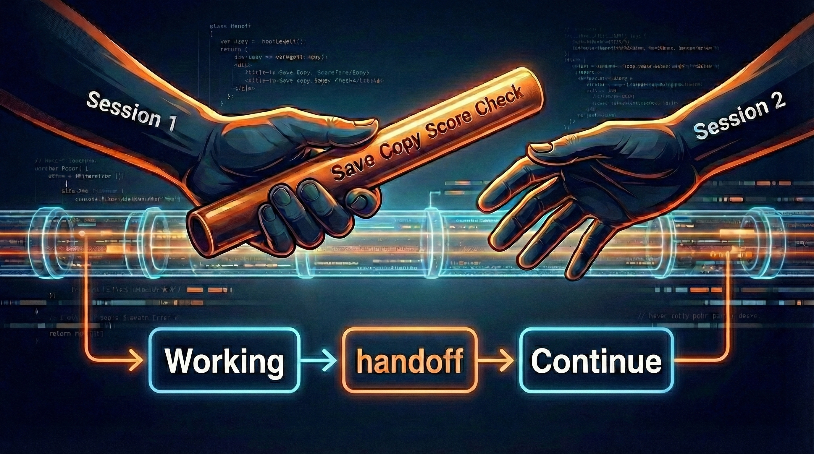

<div id="top"></div>

<div align="center">



**100K 토큰짜리 대화록 대신, 500토큰짜리 바톤 하나면 됩니다.**

**[English](README.md)** | **한국어**

[](LICENSE)
[](https://github.com/anthropics/claude-code)
[](https://github.com/quantsquirrel/claude-handoff-baton)
[](https://github.com/quantsquirrel/claude-handoff-baton)

</div>

---

## Quick Start

복사해서 터미널에 붙여넣으세요:

```bash
curl -o ~/.claude/commands/handoff.md \
  https://raw.githubusercontent.com/quantsquirrel/claude-handoff-baton/main/SKILL.md
```

끝. 이제 `/handoff`로 세션을 넘길 수 있어요.

<details>
<summary>토큰 모니터링부터 세션 복원까지 전부 자동으로 하고 싶다면:</summary>

```bash
git clone https://github.com/quantsquirrel/claude-handoff-baton.git ~/.claude/skills/handoff
cd ~/.claude/skills/handoff && bash hooks/install.sh
```

4개 hook이 자동 등록돼요. 토큰 모니터링, compaction 전 스냅샷, 세션 복원까지 전부 알아서 해요. `/handoff` 명령어는 hook 없이도 잘 동작하니까, hook은 자동화가 필요할 때 추가하세요.

</details>

---

## 업데이트

설치 방식에 따라 업데이트 방법이 달라요:

### Marketplace 사용자

```bash
/plugin update handoff
```

### Git Clone 사용자

```bash
cd ~/.claude/skills/handoff && git pull
```

### 수동 설치 사용자

Quick Start의 curl 명령어를 다시 실행하세요.

---

## 한 줄 요약

`--continue`는 대화를 되감아요. Handoff는 결론만 넘겨요.

| `--continue` (원시 히스토리) | Handoff Baton (증류된 지식) |
|---------------------------|-------------------------------|
| 전체 메시지 히스토리 로드 (100K+ token) | 핵심만 추출 (100-500 token) |
| tool 호출, 파일 읽기, 에러 전부 재생 | 결정, 실패, 다음 단계만 캡처 |
| 같은 세션, 같은 기기에서만 작동 | clipboard로 어떤 세션, 어떤 기기, 어떤 AI든 |
| 실패한 접근법이 노이즈에 묻힘 | 실패한 접근법을 명시적으로 추적 |
| 정보 우선순위 없음 | 세션 복잡도에 맞게 자동 스케일링 |

명령어 하나. 바톤 하나. 500배 압축.

---

## 1M 토큰 시대에 왜 아직 이게 필요한가

"1M token context window면 뭘 정리해야 하나요?"

context가 커질수록 handoff의 가치는 올라가요. 줄어들지 않아요.

### 비용

100K token을 매번 다시 읽히면 재개 100회에 $1,000이에요. 바톤이면 $1이에요.

| 방식 | 전송 token | 재개 1회 | 100회 재개 |
|------|-----------|---------|-----------|
| 전체 히스토리를 1M context에 투입 | ~100K token | **~$10** | **~$1,000** |
| Handoff 바톤 | ~500 token | **~$0.01** | **~$1** |

1,000배 차이예요. handoff 없이 재개할 때마다 tool 출력, 막다른 시도, 이미 잊힌 파일 내용에 예산을 태우는 거예요.

### 정확도

Stanford의 ["Lost in the Middle"](https://arxiv.org/abs/2307.03172) 연구 결과, context가 10K token을 넘으면 LLM 정확도가 **15-47% 하락**해요. 긴 대화 중간에 묻힌 정보는 사실상 안 보여요.

잘 구조화된 500 token handoff가 100K token 원본 덤프보다 정확해요. 모든 token이 노이즈가 아니라 시그널이니까요.

### 속도

긴 context는 느린 추론이에요. 100K token prompt는 500 token handoff보다 처리 시간이 훨씬 길어요. 모델이 어제 디버그 로그를 뒤지는 동안 기다릴 필요 없이, 다음 세션이 바로 시작돼요.

### 감사 추적성

1M token 대화에 묻힌 정보는 검색도, 추적도, 팀 공유도 안 돼요. Handoff 파일은 Git 네이티브 산출물이에요. diff 가능하고, 리뷰 가능하고, 프로젝트 히스토리에 남아요.

### 체크포인트 효과

handoff를 만들면 스스로에게 물어보게 돼요. "뭘 완료했지? 뭐가 실패했지? 다음은?" 이건 오버헤드가 아니에요. 시니어 엔지니어가 효과적인 이유와 같아요. 좋은 개발자는 기억에 의존하지 않아요. 기록해요.

---

## --continue로 충분하지 않나요?

`claude --continue`는 짧은 휴식에 좋아요. 하지만 한계가 있어요:

- **token 낭비**: tool 출력, 파일 내용, 막다른 골목까지 전부 복원해요. 200K context가 빠르게 차요.
- **지식 추출 없음**: 원시 히스토리는 중요한 걸 강조하지 않아요. 실패한 접근법이 노이즈에 묻혀요.
- **단일 도구 종속**: Claude Code 안에서만 동작해요. Claude.ai, 팀원, 다른 AI와 context 공유가 안 돼요.
- **신뢰성 문제**: [세션 복원 버그](https://github.com/anthropics/claude-code/issues/22107)로 context가 조용히 사라질 수 있어요.

--continue는 대화를 되감아요. Handoff는 결론만 넘겨요. 둘은 경쟁이 아니라 보완이에요:

| 상황 | 최적 도구 |
|------|-----------|
| 짧은 휴식 (30분 이내) | `claude --continue` |
| 긴 휴식 (2시간+) | `/handoff` -> Cmd+V |
| 기기 전환 | `/handoff` -> Cmd+V |
| 팀원에게 context 공유 | `/handoff` |
| context 70%+ 도달 | `/handoff` |

---

## 사용법

### 워크플로우

```
1. /handoff          → context가 clipboard에 저장됨
2. /clear            → 새 세션 시작
3. Cmd+V (붙여넣기)  → 전체 context로 재개
```

### 명령어

```bash
/handoff [topic]             # 세션 복잡도에 따라 자동 스케일링
```

<sub>예시: `/handoff` | `/handoff "auth migration"` | `/handoff "JWT refactor"`</sub>

| 상황 | 명령어 |
|------|--------|
| context 70%+ 도달 | `/handoff` |
| 세션 체크포인트 | `/handoff` |
| 세션 종료 | `/handoff` |
| 긴 휴식 (2시간+) | `/handoff` |

---

## 알아서 길이를 맞춰줘요

세션 복잡도에 따라 출력 깊이가 자동 조절돼요. 수동으로 레벨을 고를 필요 없어요:

| 레벨 | token 예산 | 트리거 조건 | 포함 섹션 |
|------|-----------|------------|-----------|
| **L1** | ~100 token | 10개 미만 메시지 OR 1개 파일 수정 | Time, Topic, Summary, Next Step |
| **L2** | ~300 token | 10-50개 메시지 OR 2-10개 파일 수정 | L1 + User Requests, Key Decisions, Failed Approaches, Files Modified |
| **L3** | ~500 token | 50개+ 메시지 OR 10개+ 파일 수정 | 전체 템플릿 (모든 섹션) |

메시지 수와 파일 수가 다른 레벨을 가리키면 높은 쪽이 적용돼요. `/handoff`만 실행하세요.

---

## 원본 맥락, 그대로

v2.3은 원본 context를 더 충실하게 보존해요:

| 기능 | 설명 |
|------|------|
| **Phase 0 검증** | 의미 있는 작업이 없으면 handoff를 건너뛰어요 |
| **User Requests** | 사용자 요청을 의역 없이 원문 그대로 캡처해요 (10개+ 메시지) |
| **Constraints** | 사용자가 명시한 제약 조건을 원문 그대로 기록해요 (50개+ 메시지) |
| **관점 가이드** | 완료 작업은 1인칭, 미완료 작업은 객관적 서술이에요 |

### Phase 0: 빈 세션 검사

handoff 생성 전에 다음 중 하나 이상이 참인지 검증해요:

- tool을 사용했거나
- 파일을 수정했거나
- 실질적인 사용자 메시지가 있거나

하나도 해당하지 않으면: `"No significant work in this session. Handoff skipped."`

### User Requests 섹션

사용자 요청을 의역 없이 원문 그대로 캡처해요:

```markdown
## User Requests
- "JWT auth with refresh token rotation and RBAC"
- "Use async bcrypt, sync is too slow"
```

### Constraints 섹션

사용자가 명시한 제약 조건을 그대로 보존해요 (전체 상세 세션에만 포함):

```markdown
## Constraints
- "Use async bcrypt, sync is too slow"
- "Store tokens in httpOnly cookies, not localStorage"
```

---

## 워크플로우

```
Session 1 → /handoff → Cmd+V → Session 2
```

세 단계예요:

1. **작업 중** - 코딩 세션을 진행해요
2. **저장** - context가 높아지거나 자리를 비울 때 `/handoff` 실행
3. **재개** - 새 세션에서 `Cmd+V` (또는 `Ctrl+V`)로 붙여넣기

**`/resume` 같은 별도 명령어는 없어요.** 그냥 붙여넣으세요.

---

## 저장되는 내용

handoff는 세션 복잡도에 맞게 핵심 정보를 캡처해요:

- **Summary** -- 1-3문장으로 무슨 일이 있었는지
- **User Requests** -- 사용자 요청 원문 그대로 (v2.3)
- **Completed / Pending** -- 완료 작업과 미완료 작업
- **Failed Approaches** -- 실패한 접근법 (같은 실수 반복 방지)
- **Key Decisions** -- 왜 그 선택을 했는지
- **Files Modified** -- 수정된 파일 목록
- **Constraints** -- 사용자가 명시한 제약 조건 원문 (v2.3)
- **Next Step** -- 구체적인 다음 액션

내용이 없는 섹션은 자동으로 생략돼요.

---

## 작업 크기, 알아서 판단해요

Handoff는 작업 복잡도를 자동으로 감지하고, handoff 타이밍을 조절해요.

### 동작 방식

세 단계로 판단해요:

1. **프롬프트 분석** - 요청에서 "전체", "리팩토링", "migrate", "entire" 같은 키워드를 스캔해서 Small / Medium / Large / XLarge로 분류해요
2. **파일 수 감지** - Glob/Grep 결과에서 파일 수를 세고, 파일이 많으면 작업 크기를 자동으로 올려요
3. **동적 임계값** - 복잡한 작업일수록 더 일찍 handoff를 제안해서 context overflow를 막아요

### 예시

```
You: "Refactor all authentication and migrate entire user database"

Large task detected - handoff will trigger at 50% (vs. 85% for small tasks)
```

복잡한 작업에서는 handoff 제안이 더 일찍 나와서, 진행 상황을 잃을 위험이 줄어들어요.

---

## 보안

API 키, JWT, Bearer 토큰 -- 바톤에 담기기 전에 자동으로 걸러져요:

```
API_KEY=sk-1234...  → API_KEY=***REDACTED***
PASSWORD=secret     → PASSWORD=***REDACTED***
Authorization: Bearer eyJ...  → Authorization: Bearer ***REDACTED***
```

자동 감지 대상이에요:

- API 키, secret
- JWT token, Base64 인코딩된 자격증명
- Authorization header의 Bearer token
- 민감한 패턴을 가진 환경 변수

**GDPR 참고:** handoff 문서에 개인 데이터가 포함될 수 있어요. 제3자와 공유하기 전에 내용을 확인하고, 오래된 handoff는 정기적으로 삭제하세요.

---

## 붙여넣기해도 멋대로 실행되지 않아요

clipboard 포맷에 자동 실행 방지 장치가 포함돼 있어요:

```
<previous_session context="reference_only" auto_execute="false">
STOP: This is reference material from a previous session.
Do not auto-execute anything below. Wait for user instructions.
</previous_session>
```

새 세션에 붙여넣어도 Claude가 이전 작업을 멋대로 이어가지 않아요. 사용자 지시를 기다려요.

---

## 더 쓰고 싶다면: 자동화 훅

**v2.4 신규:** compaction 전후 context 보존 + 통합 token 추적이에요.

### 4개 hook

| Hook | 파일 | 역할 |
|------|------|------|
| **PrePromptSubmit** | `task-size-estimator.mjs` | 프롬프트 키워드로 작업 크기 감지 |
| **PostToolUse** | `auto-handoff.mjs` | token 사용량 모니터링, 동적 임계값에서 `/handoff` 제안 |
| **PreCompact** | `pre-compact.mjs` | compaction 전 메타데이터 스냅샷 저장 |
| **SessionStart** | `session-restore.mjs` | compact/resume 후 최적 context 복원 |

### context 모니터링

통합 token 추적으로 call-level dedup을 해서 이중 카운트를 막아요. 작업 크기에 따라 임계값이 달라져요:

- **Small tasks**: 85% / 90% / 95%
- **Medium tasks**: 70% / 80% / 90%
- **Large tasks**: 50% / 60% / 70%
- **XLarge tasks**: 30% / 40% / 50%

### context 보존 (v2.4)

PreCompact가 git 상태, 수정 파일, token 수를 compaction 전에 자동 저장해요. SessionStart가 `score = base * freshness + relevance` 공식으로 복원 소스를 평가해서 가장 좋은 소스 하나를 선택해요. handoff .md 파일이 pre-compact 스냅샷보다 우선해요. 오래된 스냅샷은 자동 정리돼요 (최근 3개만 보관).

### 설치

```bash
git clone https://github.com/quantsquirrel/claude-handoff-baton.git ~/.claude/skills/handoff
cd ~/.claude/skills/handoff && bash hooks/install.sh
```

installer가 4개 hook을 자동으로 등록해요.

### 디버그 모드

```bash
AUTO_HANDOFF_DEBUG=1       # context 모니터링 로그
PRE_COMPACT_DEBUG=1        # pre-compact 스냅샷 로그
SESSION_RESTORE_DEBUG=1    # 세션 복원 스코어링 로그
```

### 제한 사항

- **단일 노드 전용**: file locking이 로컬 파일시스템 lock을 사용해요.

---

## 프로젝트 구조

```
claude-handoff-baton/
├── SKILL.md                     # skill 파일 (~/.claude/commands/에 복사)
├── README.md
├── hooks/
│   ├── utils.mjs                # 공통 유틸리티 (lock, state I/O, token 추적)
│   ├── constants.mjs            # 공통 상수, 임계값, 보안 패턴
│   ├── schema.mjs               # 구조화된 handoff 출력의 JSON schema
│   ├── task-size-estimator.mjs  # PrePromptSubmit: 작업 크기 감지
│   ├── auto-handoff.mjs         # PostToolUse: context 모니터링
│   ├── auto-checkpoint.mjs      # PostToolUse: 시간/token 기반 checkpoint 트리거
│   ├── pre-compact.mjs          # PreCompact: compaction 전 메타데이터 스냅샷
│   ├── session-restore.mjs      # SessionStart: compact/resume 후 context 복원
│   ├── lockfile.mjs             # 중단된 handoff의 lock 파일 관리
│   ├── recover.mjs              # 중단된 handoff 복구 스크립트
│   ├── install.sh               # 간편 설치 (4개 hook 자동 등록)
│   └── test-task-size.mjs       # 통합 테스트
├── plugins/
│   └── handoff/
│       ├── plugin.json          # Plugin manifest (v2.2)
│       └── skills/
│           └── handoff.md       # 자동 스케일링 skill 정의
└── examples/
    └── example-handoff.md
```

---

## 라이선스

**MIT License** - [LICENSE](LICENSE) 파일을 확인하세요.

---

## 기여

이슈와 PR을 환영해요. [GitHub](https://github.com/quantsquirrel/claude-handoff-baton)에서 참여하세요.

---

바톤을 넘겨보세요. 대화 기록을 복사-붙여넣기하던 시절은 끝났어요. `/handoff`를 실행하세요.

<div align="right"><a href="#top">Back to Top</a></div>
