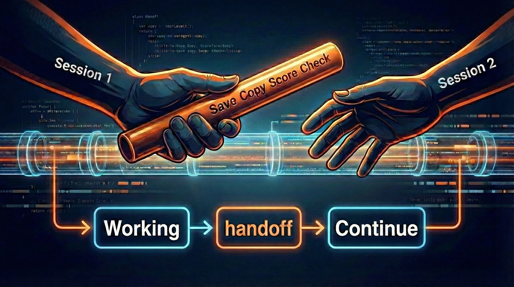

<div id="top"></div>

<div align="center">



**Don't pass raw history. Pass a baton — distilled, structured, ready to run.**

**English** | **[한국어](README-ko.md)**

[](LICENSE)
[](https://github.com/anthropics/claude-code)
[](https://github.com/quantsquirrel/claude-handoff-baton)
[](https://github.com/quantsquirrel/claude-handoff-baton)

</div>

---

## Quick Start

### Option 1: Single File (Recommended)

```bash
curl -o ~/.claude/commands/handoff.md \
  https://raw.githubusercontent.com/quantsquirrel/claude-handoff-baton/main/SKILL.md
```

**Done.** Now you can use `/handoff`.

### Option 2: Full Plugin (Advanced)

For auto-notifications when context reaches 70%:

```bash
/plugin marketplace add quantsquirrel/claude-handoff-baton
/plugin install handoff@quantsquirrel
```

This includes:
- Auto-handoff reminder at 70% context
- Task size estimation
- CLI autocomplete for `/handoff`

---

## Updating

### Marketplace Users

```bash
/plugin update handoff
```

### Git Clone Users

```bash
cd ~/.claude/skills/handoff && git pull
```

### Manual Install Users

Re-run the curl command from Quick Start to download the latest version.

---

## What is Handoff Baton?

**`--continue` restores conversations. Handoff passes a baton — distilled, structured, ready to run.**

| `--continue` (Raw History) | Handoff Baton (Distilled Knowledge) |
|---------------------------|-------------------------------|
| Loads entire message history (100K+ tokens) | Extracts essence in 100-500 tokens |
| Replays tool calls, file reads, errors | Captures decisions, failures, and next steps |
| Same session, same machine only | Clipboard: any session, any device, any AI |
| Doesn't highlight what failed | Explicitly tracks failed approaches |
| No prioritization of information | Smart auto-scaling for your needs |

**One command. One baton. 500x compression.**

---

## Why Not Just `--continue`?

`claude --continue` is great for short breaks. But it has limits:

- **Token bloat**: Restores *everything* — tool outputs, file contents, dead ends. Your 200K context fills fast.
- **No knowledge extraction**: Raw history doesn't highlight what matters. Failed approaches hide in noise.
- **Single-tool lock-in**: Only works within Claude Code. Can't share context with Claude.ai, teammates, or other AIs.
- **Reliability**: [Session resume bugs](https://github.com/anthropics/claude-code/issues/22107) can lose context silently.

**Handoff complements `--continue`:**

| Situation | Best Tool |
|-----------|-----------|
| Short break (< 30 min) | `claude --continue` |
| Long break (2+ hours) | `/handoff` → Cmd+V |
| Switching devices | `/handoff` → Cmd+V |
| Sharing context with team | `/handoff` |
| Context at 70%+ | `/handoff` |

---

## Usage

### Workflow

```
1. /handoff          → Context saved to clipboard
2. /clear            → Start fresh session
3. Cmd+V (paste)     → Resume with full context
```

### Commands

```bash
/handoff [topic]             # Smart handoff (auto-scales based on session complexity)
```

<sub>Examples: `/handoff` · `/handoff "auth migration"` · `/handoff "JWT refactor"`</sub>

| Situation | Command |
|-----------|---------|
| Context 70%+ reached | `/handoff` |
| Session checkpoint | `/handoff` |
| Session end | `/handoff` |
| Long break (2+ hours) | `/handoff` |

---

## Smart Auto-Scaling (v2.2)

Output depth adjusts automatically based on session complexity:

| Session Size | Output |
|-------------|--------|
| Under 10 messages | Summary + Next Step |
| 10-50 messages | Summary + Key Decisions + Files Modified + Next Step |
| Over 50 messages | Full detail (all sections) |

No manual level selection needed. Just run `/handoff`.

---

## Context Fidelity (v2.3)

v2.3 preserves the original context more faithfully:

| Feature | Description |
|---------|-------------|
| **Phase 0 Validation** | Skips handoff when the session has no meaningful work |
| **User Requests** | Captures original user requests verbatim (10+ messages) |
| **Constraints** | Records user-stated constraints as-is (50+ messages) |
| **Perspective Guide** | Completed work in first person, pending work in objective voice |

### Phase 0: Empty Session Check

Before creating a handoff, the skill validates that at least one of these is true:
- A tool was used
- A file was modified
- A substantive user message exists

If none: `"No significant work in this session. Handoff skipped."`

### User Requests Section

Original user requests are captured verbatim — not paraphrased:

```markdown
## User Requests
- "JWT auth with refresh token rotation and RBAC"
- "Use async bcrypt, sync is too slow"
```

### Constraints Section

User-stated constraints are preserved exactly as spoken (full-detail sessions only):

```markdown
## Constraints
- "Use async bcrypt, sync is too slow"
- "Store tokens in httpOnly cookies, not localStorage"
```

---

## Workflow

```
Session 1 → /handoff → Cmd+V → Session 2
```

1. **Working** - You're deep in a coding session
2. **Save** - Run `/handoff` when context is high or before leaving
3. **Resume** - Paste in new session with `Cmd+V` (or `Ctrl+V`)

**No `/resume` command needed.** Just paste.

---

## What Gets Saved

Handoff captures what matters, scaled to session complexity:

- **Summary** — What happened in 1-3 sentences
- **User Requests** — Original requests verbatim (v2.3)
- **Completed / Pending tasks** — Progress tracking
- **Failed approaches** — Don't repeat mistakes
- **Key decisions** — Why you chose what you chose
- **Modified files** — What changed
- **Constraints** — User-stated constraints as-is (v2.3)
- **Next step** — Concrete next action

Sections with no content are automatically omitted.

---

## Task Size Detection (v2.0)

Handoff now intelligently detects task complexity and adjusts handoff timing accordingly.

### How It Works

1. **Prompt Analysis**
   - Scans your request for keywords like "전체", "리팩토링", "migrate", "entire"
   - Classifies task as Small / Medium / Large / XLarge

2. **File Count Detection**
   - Counts files from Glob/Grep results
   - Automatically upgrades task size when many files involved

3. **Dynamic Thresholds**
   - Suggests handoff earlier for complex tasks
   - Prevents context overflow on large refactors

### Example

```
You: "Refactor all authentication and migrate entire user database"

Large task detected - handoff will trigger at 50% (vs. 85% for small tasks)
```

This means you'll be prompted to create a handoff earlier, reducing the risk of losing progress.

---

## Security

Sensitive data is auto-detected and redacted:

```
API_KEY=sk-1234...  → API_KEY=***REDACTED***
PASSWORD=secret     → PASSWORD=***REDACTED***
Authorization: Bearer eyJ...  → Authorization: Bearer ***REDACTED***
```

**Detection includes:**
- API keys and secrets
- JWT tokens and Base64-encoded credentials
- Bearer tokens in Authorization headers
- Environment variables with sensitive patterns

**GDPR Consideration:** Handoff documents may contain personal data. Review handoffs before sharing with third parties and delete old handoffs regularly.

---

## Auto-Execution Prevention

The clipboard format includes safeguards to prevent Claude from auto-executing tasks:

```
<previous_session context="reference_only" auto_execute="false">
STOP: This is reference material from a previous session.
Do not auto-execute anything below. Wait for user instructions.
</previous_session>
```

---

## Optional: Auto-Handoff Hook (v2.0)

**New in v2.0:** Dynamic thresholds based on task size!

### Features

1. **Task Size Detection (PrePromptSubmit)**
   - Analyzes your prompt for large task indicators
   - Provides proactive warnings before starting large tasks
   - Dynamically adjusts handoff thresholds

2. **Smart Context Monitoring (PostToolUse)**
   - Tracks context usage across tools
   - Suggests `/handoff` at optimal times based on task complexity:
     - **Small tasks**: 85% / 90% / 95%
     - **Medium tasks**: 70% / 80% / 90%
     - **Large tasks**: 50% / 60% / 70%
     - **XLarge tasks**: 30% / 40% / 50%

3. **File Count Detection**
   - Automatically upgrades task size when many files are involved
   - 10+ files → Medium, 50+ files → Large, 200+ files → XLarge

### Installation

```bash
# Clone for hook files
git clone https://github.com/quantsquirrel/claude-handoff-baton.git ~/.claude/skills/handoff

# Install both hooks
cd ~/.claude/skills/handoff && bash hooks/install.sh
```

The installer will register:
- **PrePromptSubmit hook**: Task size estimator
- **PostToolUse hook**: Context monitor with dynamic thresholds

### Limitations

- **Single-node only**: The file locking mechanism uses local filesystem
  locks and is not designed for distributed deployments.

---

## Project Structure

```
claude-handoff-baton/
├── SKILL.md                    # The skill (copy to ~/.claude/commands/)
├── README.md
├── hooks/
│   ├── constants.mjs           # Shared constants, thresholds, security patterns
│   ├── schema.mjs              # JSON schema for structured handoff output
│   ├── task-size-estimator.mjs # PrePromptSubmit: Task size detection
│   ├── auto-handoff.mjs        # PostToolUse: Context monitoring (v2.0)
│   ├── install.sh              # Easy installation (registers both hooks)
│   └── test-task-size.mjs      # Integration tests
├── plugins/
│   └── handoff/
│       ├── plugin.json         # Plugin manifest (v2.2)
│       └── skills/
│           └── handoff.md      # Skill definition with smart auto-scaling
└── examples/
    └── example-handoff.md
```

---

## License

**MIT License** - See [LICENSE](LICENSE) for details.

---

## Contributing

Issues and PRs welcome at [GitHub](https://github.com/quantsquirrel/claude-handoff-baton).

---

**Ready to pass the baton?** Run `/handoff` — don't pass raw history, pass distilled knowledge.

<div align="right"><a href="#top">Back to Top</a></div>
