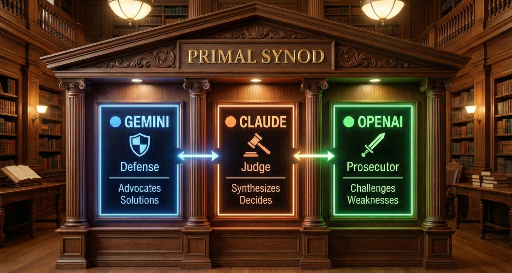
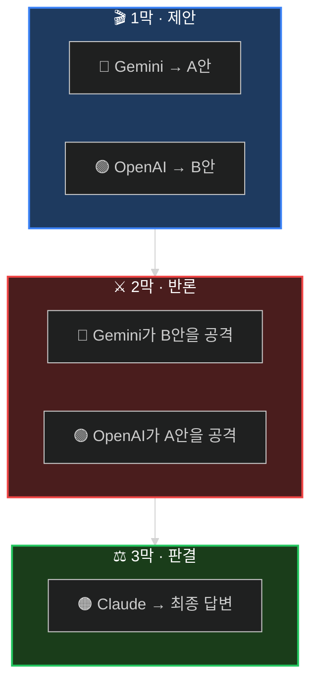

<div align="center">

<!-- Hero Banner -->


<br/>

<!-- Tagline -->
### *하나의 AI로 부족할 때, 의회를 소집하라.*

<br/>

<!-- Status Badges -->
<p>
<a href="#-60초-설정"></a>
<a href="https://arxiv.org/abs/2309.13007"></a>
<a href="LICENSE"></a>
<a href="https://github.com/quantsquirrel/claude-synod-debate"></a>
</p>

<!-- Language Toggle -->
**[English](README.md)** · **[한국어](README.ko.md)**

</div>

<br/>

<div align="center">

**😵‍💫 단일 LLM은 과신한다** &nbsp;→&nbsp; **⚔️ 서로 토론시켜라** &nbsp;→&nbsp; **✅ 더 나은 결론**

</div>

<br/>

---

<div align="center">

## 🎭 심의 3막

*모든 안건은 동일한 절차를 거칩니다*

</div>

<br/>


```mermaid
%%{init: {'theme': 'dark', 'themeVariables': { 'primaryColor': '#1e3a5f', 'secondaryColor': '#4a1d1d', 'tertiaryColor': '#1a3d1a'}}}%%
flowchart TB
    subgraph ACT1["🎬 1막 · 제안"]
        G1["🔵 Gemini → A안"]
        O1["🟢 OpenAI → B안"]
    end

    subgraph ACT2["⚔️ 2막 · 반론"]
        G2["🔵 Gemini가 B안을 공격"]
        O2["🟢 OpenAI가 A안을 공격"]
    end

    subgraph ACT3["⚖️ 3막 · 판결"]
        C["🟠 Claude → 최종 답변"]
    end

    ACT1 --> ACT2 --> ACT3

    style ACT1 fill:#1e3a5f,stroke:#3b82f6,stroke-width:2px,color:#fff
    style ACT2 fill:#4a1d1d,stroke:#ef4444,stroke-width:2px,color:#fff
    style ACT3 fill:#1a3d1a,stroke:#22c55e,stroke-width:2px,color:#fff
```

<div align="center">

| 막 | 과정 | 의의 |
|:---:|:----------|:------------|
| **I** | 각 모델이 독립적으로 해법을 제시 | 집단사고를 차단하고 다양성을 확보 |
| **II** | 상대방의 해법을 교차 심문 | 약점을 드러내고 편향에 도전 |
| **III** | 반론을 거쳐 최종 판결 | 검증을 통과한 답변만 살아남음 |

</div>

<br/>

---

<div align="center">

## ⚡ 60초 설정

</div>

```bash
# 1️⃣ 저장소 클론
git clone https://github.com/quantsquirrel/claude-synod-debate.git
cd claude-synod-debate

# 2️⃣ API 키 설정 (최초 1회)
export GEMINI_API_KEY="your-gemini-key"
export OPENAI_API_KEY="your-openai-key"

# 3️⃣ 초기 설정 (의존성 설치, CLI 구성, 모델 테스트)
/synod-setup

# 4️⃣ 의회 소집
/synod review 이 인증 플로우가 안전한가요?
```

<div align="center">

**이것으로 끝입니다.** 의회가 자동으로 소집됩니다.

<br/>


</div>

<br/>

---

<div align="center">

## 🧪 초기 설정 테스트

*심의 전에 모델 상태를 점검하세요*

</div>

<br/>

```bash
/synod-setup
```

<div align="center">

| 점검 항목 | 설명 |
|:---------:|:-------------|
| **CLI** | 7개 프로바이더 CLI 존재 여부 확인 |
| **API 키** | 각 프로바이더 API 키 상태 확인 |
| **응답 시간** | 모델별 120초 타임아웃으로 실제 호출 테스트 |
| **등급 분류** | ✓ 권장 / ✓ 사용 가능 / ⚠ 느림 / ✗ 실패 |

</div>

<br/>

<details>
<summary><b>📋 실행 결과 예시</b></summary>

<br/>

```
[Synod Setup] 초기 설정을 시작합니다...

Step 0/3: Python 의존성 확인
  ✓ google-genai 설치됨
  ✓ openai 설치됨
  ✓ httpx 설치됨

Step 1/3: CLI 도구 설치 (~/.synod/bin)
  ✓ gemini-3 설치됨
  ✓ openai-cli 설치됨

Step 2/3: API 키 확인
  ✓ GEMINI_API_KEY (설정됨)
  ✓ OPENAI_API_KEY (설정됨)

Step 3/3: 모델 응답 시간 측정 (타임아웃: 120초)

Provider    Model              Latency    Status
───────────────────────────────────────────────────────
gemini      flash              3.2초       ✓ 권장
gemini      pro                12.4초      ✓ 사용 가능
openai      gpt54mini          2.8초       ✓ 권장
openai      o3                 45.2초      ⚠ 느림

[완료] 4/4 모델 사용 가능
Synod를 사용할 준비가 되었습니다!
```

</details>

<br/>

---

<div align="center">

## 🤖 지원 프로바이더

*v3.0: 7개 AI 프로바이더 지원*

</div>

<br/>

<div align="center">

| 프로바이더 | CLI | 최적 용도 | 상태 |
|:--------:|:---:|:---------|:----:|
| 🔵 **Gemini** | `gemini-3` | 기본 토론자, 사고(Thinking) 모드 | 필수 |
| 🟢 **OpenAI** | `openai-cli` | 기본 토론자, o3 추론 | 필수 |
| 🟣 **DeepSeek** | `deepseek-cli` | 수학, 추론 (R1) | 선택 |
| ⚡ **Groq** | `groq-cli` | 초고속 추론 (LPU) | 선택 |
| 🌐 **OpenRouter** | `openrouter-cli` | 다중 모델 폴백 | 권장 |
| 🔶 **Grok** | `grok-cli` | 2M 컨텍스트 윈도우 | Opt-in |
| 🟠 **Mistral** | `mistral-cli` | 코드 특화, 유럽 배포 | Opt-in |

</div>

<br/>

<details>
<summary><b>🔑 확장 프로바이더 설정</b></summary>

<br/>

```bash
# 선택: 의회에 더 많은 프로바이더 추가
export DEEPSEEK_API_KEY="your-deepseek-key"   # DeepSeek R1
export GROQ_API_KEY="your-groq-key"           # Groq LPU
export OPENROUTER_API_KEY="your-openrouter-key" # OpenRouter (권장)

# Opt-in 프로바이더 (명시적 활성화 필요)
# Grok (2M 컨텍스트 윈도우)
export SYNOD_ENABLE_GROK=1
export XAI_API_KEY="your-xai-key"

# Mistral (코드 특화)
export SYNOD_ENABLE_MISTRAL=1
export MISTRAL_API_KEY="your-mistral-key"
```

</details>

<br/>

---

<div align="center">

## 🎯 다섯 가지 심의 모드

*안건에 맞는 의회 구성을 선택하세요*

</div>

<br/>

<div align="center">

| | 모드 | 활용 상황 | 구성 |
|:---:|:---:|:----------|:-----|
| 🔍 | **`review`** | 코드 리뷰, 보안 감사, PR 분석 | `Gemini Flash` ⚔️ `GPT-4o` |
| 🏗️ | **`design`** | 시스템 아키텍처 설계 | `Gemini Pro` ⚔️ `GPT-4o` |
| 🐛 | **`debug`** | 원인 불명의 버그 추적 | `Gemini Flash` ⚔️ `GPT-4o` |
| 💡 | **`idea`** | 브레인스토밍, 전략 기획 | `Gemini Pro` ⚔️ `GPT-4o` |
| 🌐 | **`general`** | 그 밖의 모든 질문 | `Gemini Flash` ⚔️ `GPT-4o` |

</div>

<br/>

<details>
<summary><b>📝 사용 예시</b></summary>

<br/>

```bash
# 코드 리뷰
/synod review "이 재귀 함수가 O(n)인가 O(n²)인가?"

# 시스템 설계
/synod design "일일 1천만 요청을 감당할 레이트 리미터 설계"

# 디버깅
/synod debug "왜 화요일에만 이 테스트가 실패하는가?"

# 브레인스토밍
/synod idea "결제 이탈률을 낮출 방법은?"
```

</details>

<br/>

---

<div align="center">

## 📜 학술적 기반

*단순한 래퍼가 아닙니다 — 학술 논문에 기반한 심의 프로토콜*

</div>

<br/>

<div align="center">

| 프로토콜 | 출처 | Synod 적용 내용 |
|:--------:|:-----|:----------------|
| **ReConcile** | [ACL 2024](https://arxiv.org/abs/2309.13007) | 3라운드 수렴 (95% 이상 품질 향상) |
| **AgentsCourt** | [arXiv 2024](https://arxiv.org/abs/2408.08089) | 판사 / 변호인 / 검사 역할 구조 |
| **ConfMAD** | [arXiv 2025](https://arxiv.org/abs/2502.06233) | 신뢰도 기반 소프트 디퍼 |
| **Free-MAD** | 연구 | 동조 방지 지침 |
| **SID** | 연구 | 자기 신호 기반 신뢰도 측정 |

</div>

<br/>

<details>
<summary><b>📊 신뢰 점수 산출 공식</b></summary>

<br/>

Synod는 **CortexDebate** 공식으로 각 응답의 신뢰도를 산출합니다:

```
                신뢰성(C) × 일관성(R) × 관련성(I)
신뢰 점수(T) = ──────────────────────────────────
                      자기 지향성(S)
```

| 요소 | 측정 대상 | 범위 |
|:----:|:---------|:----:|
| **C** (Credibility) | 근거의 품질 | 0–1 |
| **R** (Reliability) | 논리적 일관성 | 0–1 |
| **I** (Intimacy) | 문제와의 관련성 | 0–1 |
| **S** (Self-Orientation) | 편향 수준 (낮을수록 좋음) | 0.1–1 |

**해석 기준:**
- `T ≥ 1.5` → 1차 출처 수준 (높은 신뢰)
- `T ≥ 1.0` → 신뢰할 수 있는 입력
- `T ≥ 0.5` → 참고하되 주의 필요
- `T < 0.5` → 최종 합성에서 제외

</details>

<br/>

---

<div align="center">

## 📦 설치

</div>

<details>
<summary><b>🚀 빠른 설치 (권장)</b></summary>

<br/>

```bash
# 저장소 클론
git clone https://github.com/quantsquirrel/claude-synod-debate.git
cd claude-synod-debate

# API 키 설정
export GEMINI_API_KEY="your-gemini-key"
export OPENAI_API_KEY="your-openai-key"

# Claude Code 안에서 초기 설정 실행 (Python 의존성 설치, CLI 래퍼 생성, 모델 테스트까지 자동 처리)
/synod-setup
```

이 디렉토리 안에서 Claude Code를 열면 `plugin.json`을 통해 스킬이 자동 로드됩니다. `/synod-setup`이 나머지를 처리합니다: Python 의존성 (`google-genai`, `openai`, `httpx`) 설치, `~/.synod/bin/`에 CLI 래퍼 생성, API 키 검증, 모델 연결 테스트.

</details>

<details>
<summary><b>🔧 수동 설치 (Claude Code 없이)</b></summary>

<br/>

```bash
git clone https://github.com/quantsquirrel/claude-synod-debate.git
cd claude-synod-debate
pip install google-genai openai httpx

# CLI 래퍼 생성 및 모델 테스트
python3 tools/synod-setup.py
```

</details>

<details>
<summary><b>⚙️ 환경 변수</b></summary>

<br/>

```bash
# 필수
export GEMINI_API_KEY="your-gemini-key"
export OPENAI_API_KEY="your-openai-key"

# 선택
export SYNOD_SESSION_DIR="~/.synod/sessions"
export SYNOD_RETENTION_DAYS=30
```

</details>

<br/>

---

<div align="center">

## 🔒 호환성

</div>

<br/>

<div align="center">

| 환경 | 지원 | 비고 |
|:----:|:----:|:-----|
| **bash** | ✅ | 완전 지원 |
| **zsh** | ✅ | 완전 지원 (v3.0.1+) |
| **MCP 플러그인** | ✅ | 가드 지시문으로 라우팅 간섭 방지 |
| **OMC (oh-my-claudecode)** | ✅ | CODEX-ROUTING 옵트아웃 내장 |

</div>

<br/>

<details>
<summary><b>🛡️ MCP 라우팅 보호</b></summary>

<br/>

Synod는 외부 모델(Gemini, OpenAI)을 **CLI 도구**(`gemini-3`, `openai-cli`)로만 실행합니다. MCP 라우팅 플러그인이 `ask_codex`나 `ask_gemini`으로 모델 호출을 가로채는 환경에서도, Synod의 다중 방어 체계가 이를 방지합니다:

1. **`allowed-tools` 프론트매터** — 스키마 수준에서 MCP 도구 사용을 제한
2. **마크다운 지시문** — 스킬 진입점과 Phase 0/1에서 명시적으로 금지
3. **자동 테스트** — CI가 가드 존재 여부를 지속적으로 검증

별도 설정 없이 자동으로 보호됩니다.

</details>

<br/>

---

<div align="center">

## 🗺️ 로드맵

</div>

- [ ] **MCP 서버** — Claude Code 네이티브 통합
- [ ] **VS Code 확장** — 토론 시각화 GUI
- [ ] **지식 베이스** — 과거 토론 이력 학습
- [ ] **웹 대시보드** — 실시간 토론 모니터링
- [x] **프로바이더 확장** — ~~Llama, Mistral, Claude 변형~~ **v3.0: 7개 프로바이더 지원!**

<br/>

---

<div align="center">

## 🤝 의회에 참여하세요

**[이슈](https://github.com/quantsquirrel/claude-synod-debate/issues)** · **[토론](https://github.com/quantsquirrel/claude-synod-debate/discussions)** · **[기여하기](CONTRIBUTING.md)**

<br/>

<details>
<summary><b>📖 인용</b></summary>

```bibtex
@software{synod2026,
  title   = {Synod: Multi-Agent Deliberation for Claude Code},
  author  = {quantsquirrel},
  year    = {2026},
  url     = {https://github.com/quantsquirrel/claude-synod-debate}
}
```

</details>

<br/>

**MIT 라이선스** · Copyright © 2026 quantsquirrel

*다음 연구의 어깨 위에 서서*<br/>
**ReConcile** · **AgentsCourt** · **ConfMAD** · **Free-MAD** · **SID**

<br/>

> *"의논이 많으면 안전을 얻느니라."* — 잠언 11:14

</div>
