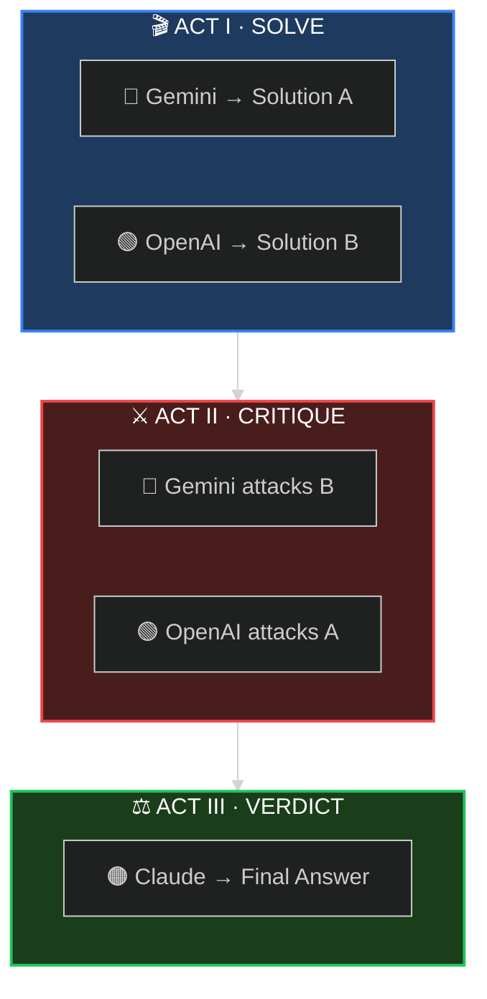

<div align="center">

<!-- Hero Banner -->


<br/>

<!-- Tagline -->
### *When one AI isn't enough, convene the council.*

<br/>

<!-- Status Badges -->
<p>
<a href="#-60-second-setup"></a>
<a href="https://arxiv.org/abs/2309.13007"></a>
<a href="LICENSE"></a>
<a href="https://github.com/quantsquirrel/claude-synod-debate"></a>
</p>

<!-- Language Toggle -->
**[English](README.md)** · **[한국어](README.ko.md)**

</div>

<br/>

<div align="center">

**😵‍💫 Single LLMs are overconfident** &nbsp;→&nbsp; **⚔️ Make them debate** &nbsp;→&nbsp; **✅ Better decisions**

</div>

<br/>

---

<div align="center">

## 🎭 THE THREE ACTS

*Every deliberation follows the same dramatic structure*

</div>

<br/>



<div align="center">

| Act | What Happens | Why It Matters |
|:---:|:-------------|:---------------|
| **I** | Independent solutions emerge | No groupthink — maximum diversity |
| **II** | Cross-examination begins | Weaknesses exposed — biases challenged |
| **III** | Adversarial refinement | Best ideas survive scrutiny |

</div>

<br/>

---

<div align="center">

## ⚡ 60-SECOND SETUP

</div>

```bash
# 1️⃣ Clone the repo
git clone https://github.com/quantsquirrel/claude-synod-debate.git
cd claude-synod-debate

# 2️⃣ Set your API keys (one-time)
export GEMINI_API_KEY="your-gemini-key"
export OPENAI_API_KEY="your-openai-key"

# 3️⃣ Run setup (installs deps, configures CLI tools, tests models)
/synod-setup

# 4️⃣ Summon the council
/synod review Is this authentication flow secure?
```

<div align="center">

**That's it.** The council convenes automatically.

<br/>


</div>

<br/>

---

<div align="center">

## 🔧 INITIAL SETUP TEST

*Verify your models work before deliberating*

</div>

<br/>

```bash
/synod-setup
```

<div align="center">

| Check | What It Does |
|:-----:|:-------------|
| **CLI** | Verifies all 7 provider CLIs exist |
| **API Keys** | Checks all provider API keys |
| **Response Time** | Tests each model with 120s timeout |
| **Classification** | Labels models: ✓ Recommended / ✓ Usable / ⚠ Slow / ✗ Failed |

</div>

<br/>

<details>
<summary><b>📋 Sample Output</b></summary>

<br/>

```
[Synod Setup] 초기 설정을 시작합니다...

Step 0/4: Python 의존성 확인
  ✓ google-genai 설치됨
  ✓ openai 설치됨
  ✓ httpx 설치됨

Step 1/4: CLI 도구 확인
  ✓ gemini-3.py
  ✓ openai-cli.py

Step 2/4: API 키 확인
  ✓ GOOGLE_API_KEY (설정됨)
  ✓ OPENAI_API_KEY (설정됨)

Step 3/4: MCP 라우팅 호환성 확인
  ✓ MCP 라우팅 미감지

Step 4/4: 모델 응답 시간 측정 (타임아웃: 120초)

Provider    Model              Latency    Status
───────────────────────────────────────────────
gemini      flash              3.2초      ✓ 권장
gemini      pro                12.4초     ✓ 사용 가능
openai      gpt4o              2.8초      ✓ 권장
openai      o3                 45.2초     ⚠ 느림

[완료] 4/4 모델 사용 가능
Synod를 사용할 준비가 되었습니다!
```

</details>

<br/>

---

<div align="center">

## 🤖 SUPPORTED PROVIDERS

*v3.0: Now supporting 7 AI providers*

</div>

<br/>

<div align="center">

| Provider | CLI | Best For | Status |
|:--------:|:---:|:---------|:------:|
| 🔵 **Gemini** | `gemini-3` | Default debater, thinking modes | Required |
| 🟢 **OpenAI** | `openai-cli` | Default debater, o3 reasoning | Required |
| 🟣 **DeepSeek** | `deepseek-cli` | Math, reasoning (R1) | Optional |
| ⚡ **Groq** | `groq-cli` | Ultra-fast inference (LPU) | Optional |
| 🌐 **OpenRouter** | `openrouter-cli` | Multi-model fallback | Recommended |
| 🔶 **Grok** | `grok-cli` | 2M context window | Opt-in |
| 🟠 **Mistral** | `mistral-cli` | Code, European deployment | Opt-in |

</div>

<br/>

<details>
<summary><b>🔑 Extended Provider Setup</b></summary>

<br/>

```bash
# Optional: Add more providers to your council
export DEEPSEEK_API_KEY="your-deepseek-key"   # DeepSeek R1
export GROQ_API_KEY="your-groq-key"           # Groq LPU
export OPENROUTER_API_KEY="your-openrouter-key" # OpenRouter (Recommended)

# Opt-in Providers (requires explicit activation)
# Grok (2M context window)
export SYNOD_ENABLE_GROK=1
export XAI_API_KEY="your-xai-key"

# Mistral (code specialization)
export SYNOD_ENABLE_MISTRAL=1
export MISTRAL_API_KEY="your-mistral-key"
```

</details>

<br/>

---

<div align="center">

## 🎯 FIVE MODES OF DELIBERATION

*Choose your council configuration*

</div>

<br/>

<div align="center">

| | Mode | Summon When... | Configuration |
|:---:|:---:|:---------------|:--------------|
| 🔍 | **`review`** | Analyzing code, security, PRs | `Gemini Flash` ⚔️ `GPT-4o` |
| 🏗️ | **`design`** | Architecting systems | `Gemini Pro` ⚔️ `GPT-4o` |
| 🐛 | **`debug`** | Hunting elusive bugs | `Gemini Flash` ⚔️ `GPT-4o` |
| 💡 | **`idea`** | Brainstorming solutions | `Gemini Pro` ⚔️ `GPT-4o` |
| 🌐 | **`general`** | Everything else | `Gemini Flash` ⚔️ `GPT-4o` |

</div>

<br/>

<details>
<summary><b>📝 Example Commands</b></summary>

<br/>

```bash
# Code review
/synod review "Is this recursive function O(n) or O(n²)?"

# System design
/synod design "Design a rate limiter for 10M requests/day"

# Debugging
/synod debug "Why does this only fail on Tuesdays?"

# Brainstorming
/synod idea "How do we reduce checkout abandonment?"
```

</details>

<br/>

---

<div align="center">

## 📜 ACADEMIC FOUNDATION

*Not just another wrapper — peer-reviewed deliberation protocols*

</div>

<br/>

<div align="center">

| Protocol | Source | What Synod Implements |
|:--------:|:-------|:----------------------|
| **ReConcile** | [ACL 2024](https://arxiv.org/abs/2309.13007) | 3-round convergence (>95% quality gains) |
| **AgentsCourt** | [arXiv 2024](https://arxiv.org/abs/2408.08089) | Judge/Defense/Prosecutor structure |
| **ConfMAD** | [arXiv 2025](https://arxiv.org/abs/2502.06233) | Confidence-aware soft defer |
| **Free-MAD** | Research | Anti-conformity instructions |
| **SID** | Research | Self-signals driven confidence |

</div>

<br/>

<details>
<summary><b>📊 The Trust Equation</b></summary>

<br/>

Synod calculates trust using the **CortexDebate** formula:

```
                Credibility × Reliability × Intimacy
Trust Score = ────────────────────────────────────────
                      Self-Orientation
```

| Factor | Measures | Range |
|:------:|:---------|:-----:|
| **C** | Evidence quality | 0–1 |
| **R** | Logical consistency | 0–1 |
| **I** | Problem relevance | 0–1 |
| **S** | Bias level (lower = better) | 0.1–1 |

**Interpretation:**
- `T ≥ 1.5` → Primary source (high trust)
- `T ≥ 1.0` → Reliable input
- `T ≥ 0.5` → Consider with caution
- `T < 0.5` → Excluded from synthesis

</details>

<br/>

---

<div align="center">

## 📦 INSTALLATION

</div>

<details>
<summary><b>🚀 Quick Installation (Recommended)</b></summary>

<br/>

```bash
# Clone the repo
git clone https://github.com/quantsquirrel/claude-synod-debate.git
cd claude-synod-debate

# Set API keys
export GEMINI_API_KEY="your-gemini-key"
export OPENAI_API_KEY="your-openai-key"

# Run setup inside Claude Code (auto-installs Python deps, creates CLI wrappers, tests models)
/synod-setup
```

Skills auto-load from `plugin.json` when you open Claude Code inside this directory. `/synod-setup` handles the rest: Python dependencies (`google-genai`, `openai`, `httpx`), CLI tool wrappers in `~/.synod/bin/`, API key validation, and model connectivity testing.

</details>

<details>
<summary><b>🔧 Manual Installation (without Claude Code)</b></summary>

<br/>

```bash
git clone https://github.com/quantsquirrel/claude-synod-debate.git
cd claude-synod-debate
pip install google-genai openai httpx

# Create CLI wrappers and test models
python3 tools/synod-setup.py
```

</details>

<details>
<summary><b>⚙️ Configuration</b></summary>

<br/>

```bash
# Required
export GEMINI_API_KEY="your-gemini-key"
export OPENAI_API_KEY="your-openai-key"

# Optional
export SYNOD_SESSION_DIR="~/.synod/sessions"
export SYNOD_RETENTION_DAYS=30
```

</details>

<br/>

---

<div align="center">

## 🔒 COMPATIBILITY

</div>

<br/>

<div align="center">

| Environment | Status | Notes |
|:-----------:|:------:|:------|
| **bash** | ✅ | Fully supported |
| **zsh** | ✅ | Fully supported (v3.0.1+) |
| **MCP Plugins** | ✅ | Guard directives prevent routing interception |
| **OMC (oh-my-claudecode)** | ✅ | CODEX-ROUTING opt-out built-in |

</div>

<br/>

<details>
<summary><b>🛡️ MCP Routing Protection</b></summary>

<br/>

Synod executes external models (Gemini, OpenAI) exclusively via **CLI tools** (`gemini-3`, `openai-cli`). If your environment includes MCP routing plugins that redirect model calls through `ask_codex` or `ask_gemini`, Synod's built-in defense-in-depth guards prevent interception:

1. **`allowed-tools` frontmatter** — Schema-level restriction excludes MCP tools
2. **Markdown directives** — Explicit prohibition in skill entry point and Phase 0/1
3. **Automated tests** — CI validates guard presence against configuration drift

No additional configuration needed — protection is automatic.

</details>

<br/>

---

<div align="center">

## 🗺️ ROADMAP

</div>

- [ ] **MCP Server** — Native Claude Code integration
- [ ] **VS Code Extension** — GUI for debate visualization
- [ ] **Knowledge Base** — Learning from debate history
- [ ] **Web Dashboard** — Real-time debate monitoring
- [x] **More LLMs** — ~~Llama, Mistral, Claude variants~~ **v3.0: 7 providers supported!**

<br/>

---

<div align="center">

## 🤝 JOIN THE COUNCIL

**[Issues](https://github.com/quantsquirrel/claude-synod-debate/issues)** · **[Discussions](https://github.com/quantsquirrel/claude-synod-debate/discussions)** · **[Contributing](CONTRIBUTING.md)**

<br/>

<details>
<summary><b>📖 Citation</b></summary>

```bibtex
@software{synod2026,
  title   = {Synod: Multi-Agent Deliberation for Claude Code},
  author  = {quantsquirrel},
  year    = {2026},
  url     = {https://github.com/quantsquirrel/claude-synod-debate}
}
```

</details>

<br/>

**MIT License** · Copyright © 2026 quantsquirrel

*Built on the shoulders of*<br/>
**ReConcile** · **AgentsCourt** · **ConfMAD** · **Free-MAD** · **SID**

<br/>

> *"In the multitude of counselors there is safety."* — Proverbs 11:14

</div>
